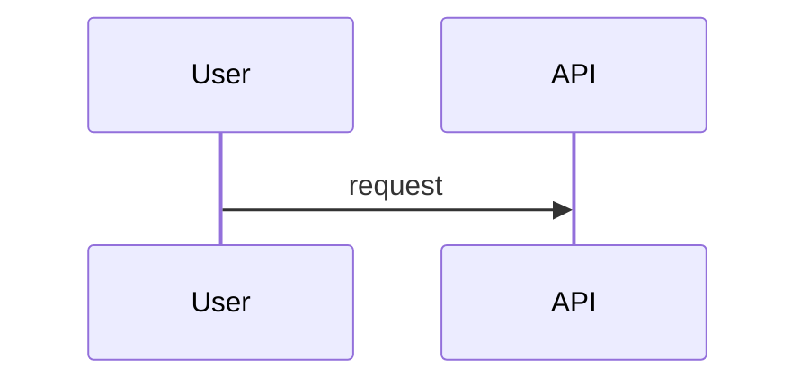

# Tiny-Chu HOW TO USE

이 문서는 Tiny-Chu를 OpenCode 플러그인으로 붙여서 작은 로컬 모델이 전체 작업을 잃지 않고, 큰 분석 작업은 큰 워커 모델에 위임하며, 설계 산출물을 근거 기반으로 작성하는 운용 방법을 정리한다.

대상 환경은 Windows 10, PowerShell 7.6, OpenCode, Ollama `gemma4-small` 오케스트레이터, `qwen3.6-35b-a3b` 분석 워커 조합이다.

## 1. 기본 구조

Tiny-Chu는 큰 에이전트 프레임워크가 아니라 작은 파일 기반 오케스트레이션 플러그인이다. 작은 모델이 직접 모든 파일을 읽고 기억하려고 하지 않도록 아래 역할만 제공한다.

- 프로젝트 규칙과 `AGENTS.md`를 모아 컨텍스트 번들을 만든다.
- `.tiny/tasks/`에 작업 상태와 checkpoint를 저장한다.
- `.tiny/plans/`의 Markdown checkbox 계획을 읽어 이어서 할 일을 판단한다.
- `.tiny/workflows/runs/`의 workflow JSON state를 source of truth로 저장한다.
- `.tiny/workflows/reports/`에 단계별 workflow report projection을 저장한다.
- `.tiny/public-jobs/`에 큰 워커 모델용 작업 패킷을 저장한다.
- `.tiny/wiki/index.json`을 기준으로 canonical wiki 문서를 묶는다.
- OpenCode 도구로 task, context, wiki, public job, artifact, Mermaid 검증 기능을 노출한다.

작은 모델은 기억에 의존하지 말고 `tool_usage_plan`, `repo_map`, `task_checkpoint`, `resume_packet`, `context_digest`, `artifact_check`를 반복해서 사용해야 한다. 상위 workflow는 `analysis_workflow_start`, `workflow_status`, `workflow_checkpoint`, `workflow_resume_packet`, `workflow_packet_fit_check`, `workflow_next`, `workflow_progress_heartbeat`, `workflow_sot_audit`로 진행한다.

## 2. OpenCode 적용

이 리포지토리는 이미 프로젝트 로컬 OpenCode 플러그인 shim을 포함한다.

```text
.opencode/
  package.json
  tui.json
  plugins/
    tiny-chu.ts
    tiny-chu-tui.ts
```

로컬 server shim은 다음 TypeScript plugin adapter를 export한다.

```ts
export { TinyChuOpenCodePlugin as TinyChu } from "../../src/opencode/plugin.ts";
```

로컬 TUI shim은 Tiny-Chu status dashboard plugin을 export한다.

```ts
export { default } from "../../src/opencode/tui-plugin.ts";
```

이 리포지토리 루트에서 OpenCode를 실행하면 `.opencode/plugins/tiny-chu.ts`가 로드되어 Tiny-Chu 도구가 활성화된다. `.opencode/tui.json`은 `.opencode/plugins/tiny-chu-tui.ts`를 켜서 `home_logo`에는 `TinyChu`를 유지하고, `home_prompt_right`, `sidebar_title`, `sidebar_content`, `sidebar_footer`, `home_bottom`에는 작업, workflow, public job, context/evidence, health 상태를 표시한다.

운영 환경이나 다른 프로젝트에 설치할 때는 전체 절차를 [INSTALL.md](./INSTALL.md)를 기준으로 맞춘다. 이 문서는 사용법을 설명하고, 설치의 canonical source는 `INSTALL.md`다.

계획이나 리서치 단계에서 다뤘지만 아직 Tiny-Chu 제품 기능으로 들어오지 않은 항목은 [docs/feature/2026-06-15-unimplemented-features.md](./docs/feature/2026-06-15-unimplemented-features.md)에 분리해 둔다.

설치 경로는 세 가지로 구분한다.

- `closed-network install`: GitHub Release 또는 배포 저장소에서 `release asset download`를 먼저 수행한 뒤, 폐쇄망 안에서는 offline bundle과 `.opencode/vendor/`의 `local tarball(.tgz) install`만 사용한다.
- `internal registry`: 조직 내부 npm registry에 Tiny-Chu와 production dependency를 mirror한 뒤 `.opencode/package.json`에서 registry version을 pin한다.
- 개발용 source checkout: Tiny-Chu 소스 수정과 smoke test에만 사용한다. 운영 배포는 `package bundle distribution`을 기준으로 하고, source checkout을 폐쇄망 기본 경로로 문서화하지 않는다.

폐쇄망/운영 대상 프로젝트는 `templates/opencode/`를 복사해서 시작한다. 핵심 형태는 아래와 같다.

```json
{
  "private": true,
  "type": "module",
  "dependencies": {
    "tiny-chu": "file:./vendor/tiny-chu-vX.Y.Z-bundled.tgz"
  }
}
```

```ts
export { TinyChuOpenCodePlugin as TinyChu } from "tiny-chu/opencode";
```

TUI dashboard plugin은 같은 `.opencode` layout에서 별도 TUI config와 shim으로 켠다.

```json
{
  "plugin": ["./plugins/tiny-chu-tui.ts"]
}
```

```ts
export { default } from "tiny-chu/tui";
```

Dashboard 표시는 OpenCode-visible `dashboard_snapshot` 도구가 만든다. 이 도구는 기존 `.tiny` task/public-job/workflow/evidence/context 상태를 읽어 보여줄 뿐 새 dashboard state store를 만들지 않는다. provider preflight는 기본값에서 실행하지 않으며, provider/network preflight는 `includeProviderPreflight`를 명시적으로 켠 경우에만 수행한다.

개발 중 다른 프로젝트에서 source checkout을 직접 붙이려면 대상 프로젝트에 아래 파일을 둔다.

```json
{
  "private": true,
  "type": "module",
  "dependencies": {
    "@opencode-ai/plugin": "^1.17.4",
    "tiny-chu": "file:/absolute/path/to/Tiny-Chu"
  }
}
```

```ts
export { TinyChuOpenCodePlugin as TinyChu } from "tiny-chu/opencode";
```

```json
{
  "plugin": ["./plugins/tiny-chu-tui.ts"]
}
```

```ts
export { default } from "tiny-chu/tui";
```

빌드 후 entrypoint smoke test:

```powershell
npm run build
node --input-type=module -e "import { TinyChuOpenCodePlugin } from './dist/opencode/plugin.js'; console.log(typeof TinyChuOpenCodePlugin)"
```

기대값은 `function`이다.

### 2.1 설치 확인 운영

설치 후에는 대상 프로젝트의 `.opencode`에서 package import와 install-check를 확인한다.

```powershell
node --input-type=module -e "import { createTinyChuPlugin } from 'tiny-chu'; console.log(typeof createTinyChuPlugin)"
node --input-type=module -e "import { TinyChuOpenCodePlugin } from 'tiny-chu/opencode'; console.log(typeof TinyChuOpenCodePlugin)"
node --input-type=module -e "const m = await import('tiny-chu/tui'); console.log(m.default.id, typeof m.default.tui)"
node --input-type=module -e "import { createTinyChuPlugin } from 'tiny-chu'; const tiny=createTinyChuPlugin({ root: process.cwd() }); console.log(await tiny.tools.tiny_chu_install_check({}));"
```

첫 두 명령의 기대값은 `function`이다. TUI command는 `tiny-chu.logo function`을 출력해야 한다. `tiny_chu_install_check`는 OpenCode tool 노출 상태를 확인하는 운영 smoke test로 사용하며, tool 목록에는 `dashboard_snapshot`이 포함되어야 한다.

`ENOTCACHED`가 나오면 일반 tarball이나 비어 있는 npm cache로 dependency를 해석하려 한 것이다. 운영 폐쇄망에서는 `INSTALL.md`의 offline bundle 절차처럼 `.opencode/vendor/`에 dependency-complete tarball이 있어야 한다.

### 2.2 Runtime mode 선택

Tiny-Chu runtime mode는 OpenCode의 deprecated top-level `mode` object가 아니라 Tiny-Chu plugin option으로 선택한다. OpenCode top-level config에서 worker 단일 구조는 mode 1, 기존 orchestrator + worker 구조는 mode 2로 둔다.

```json
{
  "plugin": [["tiny-chu", { "mode": 1 }]]
}
```

```json
{
  "plugin": [["tiny-chu", { "mode": 2 }]]
}
```

Local shim에서는 OpenCode options를 Tiny-Chu adapter로 넘기면서 mode를 고정할 수 있다.

```ts
export const TinyChu = (input, options) =>
  TinyChuOpenCodePlugin(input, { ...options, mode: 1 });
```

Library 직접 사용도 named mode를 받는다.

```ts
createTinyChuPlugin({ mode: "worker" });
createTinyChuPlugin({ mode: "orchestrator_worker" });
```

Mode 2 is the default. Mode 1은 `public_*`, `workflow_*`, `analysis_workflow_start`, `workflow_sot_audit`, `button_workflow_dispatch`를 OpenCode tool registry에서 숨기고, `worker_packet_optimizer({ dispatch: true })`는 public queue state를 쓰기 전에 거부한다.

### 2.3 안전한 source tooling opt-in

기본 OpenCode tool set은 그대로 유지된다. 작은 모델이 source file을 직접 overwrite하지 못하게 하고 싶을 때만 `safeTooling`을 켠다.

```ts
const tiny = createTinyChuPlugin({
  root: process.cwd(),
  safeTooling: true,
  nativePreviews: true,
});
```

OpenCode plugin option도 같은 이름을 사용한다.

```ts
export const TinyChu = (input, options) =>
  TinyChuOpenCodePlugin(input, { ...options, safeTooling: true, nativePreviews: true });
```

운영 순서는 `preview/check -> apply/publish -> diagnostics`다.

- source edit: patch를 만든 뒤 `safe_patch_check`를 실행하고, allowlist와 현재 `sha256:<hex>` expected hash가 맞을 때만 `safe_patch_apply`를 호출한다.
- generated docs/reports: `artifact_workspace_prepare`로 source repo 밖 OS temp workspace를 만들고, 필요하면 `artifact_workspace_commit`으로 workspace 내부 `.git`에서만 commit한 뒤 `artifact_publish_manifest`와 `artifact_publish_apply`로 publish한다.
- host/native 확인: `powershell_toolchain_probe`, `structural_search_ast`, `structural_rewrite_preview`, `json_yaml_transform_preview`, `json_patch_preview`는 선택 도구다. `pwsh`, `ast-grep`, `jq`, `yq`, `jd`가 없으면 unavailable/degraded로 보고하며 자동 설치하지 않는다.
- publish 전후 확인: `run_diagnostics`는 advisory tool이며 mutation gate가 아니다. 기본적으로 `npm run build`, `npm test` 순서를 권장한다.

이번 safe tooling 범위에는 `run_tests`, `diff_preview`, `js_ts_codemod_preview`, `merge_preview`, `semantic_diff_preview`, `delta`, `difftastic`, `mergiraf`가 포함되지 않는다.

### 2.4 내부 feature package 구조

Tiny-Chu의 OpenCode tool은 이제 `TinyFeaturePackage` descriptor를 compose해서 노출된다. 작은 모델이 `tiny-plugin.ts`, `plugin.ts`, `install-check.ts`의 병렬 목록을 기억하거나 맞춰야 하는 구조가 아니라, 하나의 generated registry가 직접 library tool, OpenCode tool spec, install-check metadata를 만든다.

기본 package id는 다음과 같다.

| Package | 책임 |
| --- | --- |
| `tiny-chu.core-runtime` | task, context, wiki, plan 상태 |
| `tiny-chu.public-worker-queue` | public worker job queue와 resume packet |
| `tiny-chu.shared-support` | scanner/input/evidence/artifact/Mermaid/PowerShell 공용 helper 규칙 |
| `tiny-chu.legacy-analysis` | repo map, business logic, FE/BE/DB/RFC trace |
| `tiny-chu.extension-utilities` | API contract, DTO, Redux, auth, error, test impact, packet/cache utility |
| `tiny-chu.button-workflow-hardening` | button 단위 local plan/packet/result, JSON-only worker result, atomic write guard |
| `tiny-chu.button-workflow-dispatch` | button workflow public queue dispatch |
| `tiny-chu.small-model-resilience` | context digest, retry, health, tool plan, resume/focus/chunked write |
| `tiny-chu.workflow-orchestration` | createWorkflow 기반 상위 workflow, stop/resume, packet fit, stage report |
| `tiny-chu.ux-reverse-engineering` | UI layout catalog, UX rationale, validation matrix, layout truth |
| `tiny-chu.doctor-artifacts` | doctor, PowerShell guard, install check, artifact/Mermaid validators |
| `tiny-chu.host-opencode` | OpenCode bridge, output budget wrapper, shell/env/compaction hook |

Registry 확인:

```ts
const tiny = createTinyChuPlugin({ root: process.cwd() });
console.log(tiny.registry.packageIds);
console.log(tiny.registry.toolSpecs.map((tool) => [tool.name, tool.packageId]));
console.log(await tiny.tools.tiny_chu_install_check({}));
```

`tiny_chu_install_check`는 기존 public field인 `packageName`, `requiredTools`, `opencodeEntrypoint`, `status`를 유지하면서 `exposedPackages`와 `nativeTools`도 함께 반환한다. 작은 모델은 새 기능을 추측하지 말고 이 결과를 보고 현재 노출 tool과 package owner를 확인한다.

새 기능 추가 절차:

1. 기존 패턴에 맞는 handler를 작은 모듈로 만든다.
2. `src/opencode/feature-packages/default-tool-seeds.ts`에 tool seed를 추가한다.
3. `src/opencode/feature-packages/default-package-seeds.ts`의 적절한 package descriptor에 seed, resources, instructions, hooks를 연결한다.
4. 필요하면 `TinyPermissionHint`, `TinySmallModelHint`, `requiredNativeTools`를 채운다.
5. `src/index.ts` root export는 기존 public ABI 보존을 기본값으로 두고, 내부 descriptor/helper는 root로 export하지 않는다.
6. `composeFeaturePackages` 테스트, registry parity 테스트, 해당 기능 테스트를 추가한다.
7. `npm run build`, `npm test`, registry smoke, duplication scan을 실행한다.

하지 말아야 할 것:

- `tiny-plugin.ts`, `plugin.ts`, `install-check.ts`에 같은 tool 이름을 각각 수동으로 추가하지 않는다.
- phase 1에서 동적 package discovery, npm subpackage loading, MCP server, Figma API adapter, provider chat/generate/completion call, package disable 기능이 있다고 가정하지 않는다. `provider_endpoint_preflight`는 명시적으로 켜는 metadata readiness probe 예외다.
- package permission hint를 host permission enforcement로 오해하지 않는다. 현재는 host가 참고할 advisory metadata다.

### 2.3 안정성 및 성능 계약

파일 기반 경계는 configured root 안으로 제한한다. wiki 문서 ref와 `git_weekly_report.repoPath`처럼 사용자가 직접 지정하거나 index가 지정한 path는 real path가 root 밖으로 나가면 fail closed한다. `AGENTS.md`, `.tiny/rules`, `.claude/rules`, `.cursor/rules`, `.github/instructions`, `.github/copilot-instructions.md`처럼 발견된 context/rule 파일은 real path가 root 안에 있을 때만 읽고, root 밖 symlink는 건너뛴다. root 안 symlink는 계속 허용한다.

`.tiny/tasks/*.json`과 `.tiny/public-jobs/*.json`이 malformed JSON이면 정상 runtime API는 `Malformed JSON in <path>` 오류로 실패한다. 이 계획의 계약은 corrupt state를 조용히 skip, rewrite, quarantine하지 않는 것이다.

같은 Node.js process 안에서는 task id, public job id, checkpoint sequence 충돌을 피한다. 여러 process가 같은 `.tiny` state를 동시에 쓰는 cross-process file locking은 구현하지 않았으므로, 그런 실행 방식은 호출자가 외부에서 직렬화해야 한다.

성능 검증은 SLA가 아니라 characterization baseline이다. 절대 latency threshold로 pass/fail하지 않고, synthetic fixture의 count/cap과 관찰용 `elapsedMs`만 기록한다.

```powershell
node scripts/stability-performance-baseline.mjs --out .omo/evidence/stability-performance-baseline.json
node scripts/stability-performance-baseline.mjs --section scanners --out .omo/evidence/scanner-performance-baseline.json
```

## 3. 권장 에이전트 구성

Tiny-Chu는 모델 라우터 자체가 아니라 OpenCode 플러그인 도구를 제공한다. 모델 배정은 OpenCode 쪽 설정에서 하되, 아래 역할을 기준으로 나눈다.

| 에이전트 | 권장 모델 | 책임 | 사용 도구 |
| --- | --- | --- | --- |
| `tiny-foreman` | Ollama `gemma4-small` | 목표 유지, 계획 분해, checkpoint, 근거 수집 요청, 워커 위임 | `doctor`, `environment_doctor`, `tool_usage_plan`, `session_preflight`, `task_focus_packet`, `context_packet`, `legacy_repo_index`, `ui_action_trace`, `api_backend_trace`, `integration_catalog`, `traceability_matrix`, `ui_layout_catalog`, `ux_rationale_trace`, `ux_validation_matrix`, `layout_truth_verify`, `evidence_qa`, `claim_evidence_check`, `task_*`, `resume_packet`, `analysis_workflow_start`, `provider_endpoint_preflight`, `tool_call_conformance_probe`, `context_budget_simulation`, `workflow_create`, `workflow_status`, `workflow_checkpoint`, `workflow_resume_packet`, `workflow_packet_fit_check`, `workflow_next`, `workflow_progress_heartbeat`, `workflow_sot_audit`, `evidence_gate`, `small_model_replay`, `context_digest`, `evidence_snapshot`, `worker_packet_optimizer`, `public_dispatch`, `public_collect`, `public_complete`, `public_job_resume_packet`, `qwen_retry_policy`, `orchestration_health`, `chunked_write_plan` |
| `repo-analyst` | `qwen3.6-35b-a3b` | 소스 구조 분석, AS-IS, 위험 분석, 설계 판단 | `repo_map`, `business_logic_map`, `legacy_repo_index`, `fd`, `rg`, `ast-grep`, `context_digest`, `artifact_check` |
| `artifact-architect` | `qwen3.6-35b-a3b` | UI 정의서, 사용자 스토리, TestCase, ERD 초안 작성 | `public_dispatch`, `wiki_bundle`, `artifact_check`, `chunked_write_plan` |
| `mermaid-reviewer` | small 또는 large | sequence, flowchart, ERD Mermaid 문법 검토 | `mdq`, `mermaid_check`, `mermaid_fix`, `mmdc` |
| `qa-reviewer` | large 권장 | 산출물의 근거 누락, 환각, 미검증 주장 검토 | `artifact_check`, `rg`, `jq`, `task_checkpoint` |
| `doc-writer` | small 가능 | 긴 Markdown 산출물 chunk 단위 작성 | `chunked_write_plan`, `artifact_check`, `mermaid_check` |

### 에이전트 운용 규칙

- Small-context operating-mode correction gate는 작은 모델이 프로젝트 전체 작업을 시작하기 전 확인하는 local-only readiness gate다. Tiny-Chu는 이 gate에서 no live provider call을 수행하지 않는다.
- 정확한 순서는 `doctor` -> `session_preflight` -> `context_packet` -> `incremental_evidence_cache` -> `tool_usage_plan` -> `worker_packet_optimizer({ dispatch: false })` -> `qwen_retry_policy` -> `claim_evidence_check` -> `artifact_pack_manifest` -> `task_checkpoint` / `resume_packet` 이다.
- `incremental_evidence_cache`는 source hash staleness만 판단한다. git dirty worktree 신호가 아니므로 executor는 별도로 `git status --short`와 `git diff -- <file>`을 확인한다.
- `tiny-foreman`은 먼저 `tool_usage_plan`으로 다음 도구 순서를 받고, 파일 전체를 읽기 전에 `repo_map`, `fd`, `rg`, `ast-grep`로 후보를 줄인다.
- `tool_usage_plan.steps`는 작은 모델을 위해 짧게 잘릴 수 있으므로, 작업 후에는 항상 `tool_usage_plan.verification.requiredTools`를 실행한 뒤 종료한다.
- 사용자가 repository path 분석을 지시하면 `analysis_workflow_start`로 task와 workflow source of truth를 함께 만든다. 일반 workflow만 필요하면 `workflow_create`를 사용한다. direct library helper 이름은 `createWorkflow`이고, `analysis` workflow를 만들 때도 이 helper와 같은 계약을 사용한다.
- provider 확인은 `provider_endpoint_preflight`로 metadata endpoint만 본다. 기본은 `networkMode: "disabled"`이고, chat/generate 요청은 readiness proof로 쓰지 않는다.
- tool call 품질은 `tool_call_conformance_probe` fixture로 먼저 확인하고, context 양은 `context_budget_simulation`과 `workflow_packet_fit_check`로 나눌지 판단한다.
- 대기 중인 것처럼 보이면 모델 답을 기다리지 말고 `workflow_progress_heartbeat`를 호출한다. 완료 선언 전에는 `evidence_gate`와 `workflow_sot_audit`를 통과해야 한다.
- workflow run JSON은 `.tiny/workflows/runs/<runId>.json`에 저장되는 JSON source of truth다. `.tiny/plans/<runId>.md`와 `.tiny/workflows/reports/<runId>/...`는 사람이 읽는 projection이다.
- phase 완료 시에는 `workflow_checkpoint({ runId, nodeId, summary, evidenceRefs, nextSteps, status: "done" })`로 저장한다. 임시 중단은 `status: "checkpointed"`를 사용해 같은 phase로 재개한다. 재개할 때는 `workflow_resume_packet({ runId })`를 먼저 호출하고, 다음 실행 단위는 `workflow_next({ runId })`로 받는다.
- 워커 호출 전 `workflow_packet_fit_check`로 `workerAgent.config.maxContextTokens` 기준의 static context-window estimate를 확인한다. 너무 큰 packet은 split하고, UI와 backend/API/DAO/SQL packet은 항상 분리하며, worker execution은 serial-only로 둔다.
- 기본 `analysis` workflow phase 순서는 `project_init`, `architecture_map`, `development_rules`, `web_route_inventory`, `page_layout_flow`, `api_backend_trace`, `dao_sql_business_logic`, `final_deliverables`다.
- 새 세션이나 이상 징후가 있으면 먼저 `doctor`로 canonical readiness를 확인한다. 순수 command 확인만 필요하면 `environment_doctor`, 실패 복구만 필요하면 `orchestration_health`를 쓴다.
- compaction 이후에는 `context_packet`과 `task_focus_packet`으로 필요한 근거와 다음 plan checkbox만 복구한다.
- 이전 `.omo/evidence`를 재사용할 때는 `evidence_snapshot`과 `incremental_evidence_cache`를 함께 확인한다.
- Button to API to Backend to DB/RFC 분석은 `legacy_repo_index` 이후 `ui_action_trace`, `api_backend_trace`, `integration_catalog`, `traceability_matrix`, `evidence_qa` 순서로 진행한다.
- 여러 버튼을 분석할 때는 `button_workflow_plan`으로 버튼별 work item을 만들고, `button_worker_packet` / `button_workflow_dispatch`로 한 worker가 한 버튼만 처리하게 한다. 워커 결과는 `markdown_envelope_check`와 `button_worker_result_check`를 통과한 뒤에만 `public_complete`한다.
- 화면 구성의 존재 이유와 위치 이유를 역공학할 때는 `ui_layout_catalog`, `ux_rationale_trace`, `ux_validation_matrix`, `ux_reverse_report`를 먼저 실행하고, 기존 memory를 재사용하기 전에는 `layout_truth_verify`를 실행한다.
- 상세 설계 분석은 `api_contract_catalog`, `dto_schema_map`, `redux_state_flow_map`, `auth_permission_trace`, `error_transaction_map`으로 반복 탐색을 JSON evidence로 줄인다.
- 산출물 배포 전에는 `claim_evidence_check`, `trace_diagram_render`, `artifact_pack_manifest`를 실행해 근거 없는 이름, 깨지는 Mermaid, 누락 산출물을 막는다.
- 산출물 생성 전에는 `artifact_format_template`으로 형식 요구사항을 먼저 가져오고, 생성 후에는 `artifact_check`를 실행한다. `.tiny/artifacts/templates/<artifactType>.md`는 override template이며 산출물 자체로 계산하지 않는다.
- 복잡한 business logic, 변수 관계, 컬럼 비교를 설명하기 전에는 `business_logic_map`을 먼저 호출한다.
- repo 사실을 말하기 전에 `context_digest`로 line citation을 확보한다.
- 큰 분석은 `public_dispatch`로 워커 패킷을 만들고, 워커 응답은 `public_collect`로 가져온다.
- Qwen 워커는 공용 제한이 있으므로 `qwen_retry_policy`의 20 requests/min, 20000 tokens/min 정책을 기준으로 분할과 retry를 계산한다.
- 워커에게 보낼 packet에는 `objective`, `artifactType`, `boundedFiles`, `evidenceRefs`, `knownUncertainties`, `mustReturn`을 포함한다.
- 워커 결과는 바로 믿지 말고 `artifact_check`, `mermaid_check`, `rg` 근거 재확인 후 checkpoint한다.
- 긴 Markdown은 한 번에 쓰지 말고 `chunked_write_plan`으로 쪼개서 작성한다.
- 실패, retry wait, compaction 이후에는 `orchestration_health`와 `resume_packet`을 확인한다.
- 구조 패턴을 확인한 뒤에는 `rules_snapshot`으로 `.tiny/rules/architecture-patterns.md`를 갱신한다. TypeScript/Node/OpenCode stack 규칙까지 남기려면 `includeStackProfiles: true`를 함께 준다.

## 4. 설치해야 할 command

PowerShell에서는 alias 대신 실제 native executable 이름을 사용한다.

| Command | 목적 | 권장 예시 |
| --- | --- | --- |
| `fd` | 파일 inventory | `fd --type f --hidden --exclude .git --exclude node_modules --exclude dist` |
| `rg` | text evidence 검색 | `rg --json --line-number --column --no-heading 'createTinyChuPlugin' src` |
| `ast-grep` | TypeScript 구조 검색 | `ast-grep run --lang ts -p 'export function $NAME($$$ARGS)' src` |
| `jq` | JSON slicing | `jq -c '.scripts' package.json` |
| `yq` | YAML/JSON 변환 | `yq -o json '.dependencies' package.json` |
| `mdq` | Markdown heading, checkbox, code fence 추출 | `mdq --output json '# Usage' HOW_TO_USE.md` |
| `mmdc` | Mermaid 실제 renderer 검증 | `mmdc -i diagram.mmd -o diagram.svg` |
| `node` / `npm` | 빌드와 테스트 | `npm run build`, `npm test` |

PowerShell 안전 규칙:

- jq/yq/mdq/rg/fd/ast-grep pattern은 작은따옴표로 감싼다.
- `$`, `[]`, `{}`, `|`, backtick이 들어간 filter를 큰따옴표로 감싸지 않는다.
- native tool의 위치 인자가 `-`로 시작하면 tool 자체의 `--` separator를 사용한다.
- bash 전용 문법인 here-document, process substitution, `xargs -0`, `VAR=value command`를 쓰지 않는다.
- JSON 출력이 가능하면 text parsing 대신 `--json`, `-o json`, `-c`를 사용한다.

권장 PowerShell session 초기화:

```powershell
$PSNativeCommandArgumentPassing = 'Standard'
$env:NO_COLOR = '1'
$env:FD_OPTIONS = '--color=never'
Remove-Item Env:RIPGREP_CONFIG_PATH -ErrorAction SilentlyContinue
```

## 5. Tiny-Chu 도구 전체 사용법

OpenCode에서는 아래 이름의 도구가 노출된다. 라이브러리에서 직접 사용할 때는 `createTinyChuPlugin()`의 `tiny.tools.<name>()`를 호출한다.

### 작업 상태 도구

| Tool | 언제 쓰나 | 핵심 input |
| --- | --- | --- |
| `task_create` | 새 분석/설계 작업 시작 | `title`, `priority`, `notes`, `planRef` |
| `task_get` | 특정 task 조회 | `id` |
| `task_list` | 상태별 task 목록 | `status` |
| `task_update` | title/status/priority/evidence 갱신 | `id`, `status`, `evidenceRefs` |
| `task_checkpoint` | pass 종료, 위임 전후, 중단 전 상태 저장 | `id`, `summary`, `artifactType`, `passIndex`, `nextSteps`, `evidenceRefs`, `openQuestions`, `verificationCommands` |
| `resume_packet` | session 시작, compaction 이후, 중단 복구 | `id` |
| `task_focus_packet` | active task, latest checkpoint, 다음 plan checkbox를 함께 복구 | `id`, `planRef`, `maxOpenItems` |

예시:

```ts
const task = await tiny.tools.task_create({
  title: "Analyze payment module",
  priority: "high",
});

await tiny.tools.task_checkpoint({
  id: task.id,
  summary: "Found entry points and unresolved auth question",
  artifactType: "as_is",
  passIndex: 1,
  nextSteps: ["scan controller routes", "ask repo-analyst for sequence"],
  evidenceRefs: ["rg://payment", "src/payment/service.ts:42"],
  openQuestions: ["which role owns refund approval?"],
  verificationCommands: ["rg --json 'refund' src/payment"],
});

const packet = await tiny.tools.resume_packet({ id: task.id });
```

### 컨텍스트 도구

| Tool | 언제 쓰나 | 결과 |
| --- | --- | --- |
| `context_bundle` | `AGENTS.md`, `.tiny/rules`, `.claude/rules`, `.cursor/rules`, `.github/instructions`를 모을 때 | project rule bundle |
| `context_packet` | compaction/resume 이후 작은 context와 evidence ref만 넘길 때 | bounded packet, omitted, truncated |
| `context_digest` | 큰 파일에서 특정 query line 근거만 뽑을 때 | bounded snippets, citations, truncated |
| `repo_map` | architecture, web button, API handler, database write 후보를 작게 맵핑할 때 | bounded layers, files, dataFlowHints, recommendedCommands |
| `business_logic_map` | business rule의 변수, 컬럼, 비교식을 상세히 보되 파일 전체를 모델에 넣지 않을 때 | variables, columns, comparisons, evidence |
| `legacy_repo_index` | React/Redux-Saga/Axios/Java/MyBatis/RFC 후보를 evidence id와 함께 색인할 때 | facts, detectedFrameworks, inventoryMarkdown |
| `ui_action_trace` | button/link/menu 이벤트를 handler/action/saga/API로 추적할 때 | rows, evidence, Unknown gaps |
| `api_backend_trace` | FE API method/path를 BE route/service/mapper/RFC로 추적할 때 | matched/unmatched endpoint, service, integration |
| `integration_catalog` | MyBatis SQL과 SAP RFC 호출을 분리 cataloging할 때 | dbCatalog, rfcCatalog |
| `traceability_matrix` | UI에서 DB/RFC까지 한 줄 matrix로 병합할 때 | JSON rows, Markdown table |
| `evidence_qa` | 산출물 publish 전 근거 누락과 hallucinated symbol을 차단할 때 | blockers, warnings, required fixes |
| `evidence_snapshot` | `.omo/evidence` 등 기존 증거 파일을 작게 요약해 재사용할 때 | cacheKey, files, sourceRefs, omittedFiles |
| `ui_layout_catalog` | React/JS/TS source에서 조회조건, 버튼, 결과 컬럼, 메시지를 source order로 cataloging할 때 | screens, elements, evidenceRefs |
| `ux_rationale_trace` | 조회조건/결과 필드의 존재 이유와 위치 이유를 보수적 status로 설명할 때 | layout truth records, unknowns |
| `ux_validation_matrix` | 값 종류에 따른 client/server 검증과 성공/실패 메시지 근거를 나눌 때 | fields, clientRules, serverRules, messageEvidence |
| `ux_reverse_report` | UX reverse 분석 Markdown을 만들 때 | `ux_reverse_analysis` markdown, evidenceRefs, Figma adapter keys |
| `layout_truth_verify` | `.tiny/ux/layout-truth.json`을 재사용하기 전에 source fingerprint를 확인할 때 | verified, stale, missing, reviewTargets |
| `layout_truth_update` | 검증된 UX 해석을 repository memory로 저장하거나 진화시킬 때 | updated records, rejected |
| `layout_truth_report` | 저장된 layout truth를 사람이 검토할 Markdown으로 볼 때 | `.tiny/ux/layout-truth.md` |
| `wiki_bundle` | `.tiny/wiki/index.json` 기준 canonical 문서를 가져올 때 | selected wiki docs |
| `orchestration_profile` | small-context 운영 규칙을 모델에게 주입할 때 | foreman/delegate/tool/audit/artifact profile |
| `tool_usage_plan` | 어떤 command/tool을 다음에 써야 할지 모델이 불확실할 때 | ordered steps, `omittedSteps`, `nextRequiredTool`, deterministic caps, stop rules |
| `provider_endpoint_preflight` | 로컬 provider endpoint 존재를 metadata-only로 확인할 때 | skipped/pass/blocked, requestAttempted, diagnostics |
| `tool_call_conformance_probe` | 작은 모델의 structured tool call fixture가 계약에 맞는지 볼 때 | pass/fail, parsed tool calls, diagnostics |
| `context_budget_simulation` | gemma/qwen context window에 packet이 맞는지 미리 볼 때 | fit/split_required, estimated tokens |
| `evidence_gate` | build/test/SOT/citation 같은 필수 증거를 최종 gate로 묶을 때 | pass/warning/fail, missingRequired |
| `small_model_replay` | 보정 전후 fixture 응답과 citation 누락을 회귀 테스트할 때 | totalCases, failedCases, diagnostics |
| `analysis_workflow_start` | repository path 분석을 task + analysis workflow로 시작할 때 | task id, run id, requiredFirstTools |
| `workflow_progress_heartbeat` | 오래 걸리는 분석이 진행/대기/정체인지 확인할 때 | shouldContinue, statusLine, sotRefs |
| `workflow_sot_audit` | final answer가 workflow JSON state와 evidence gate를 인용했는지 확인할 때 | pass/fail, diagnostics |
| `qwen_retry_policy` | Qwen public worker가 rate limit, timeout, network failure에 걸렸을 때 | limits, retry delays, minimum batches, recovery protocol |
| `worker_packet_optimizer` | Qwen worker에게 넘길 근거 packet이 커질 때 | packets, ratePlan, dispatchOrder, recoverySteps |
| `incremental_evidence_cache` | 이전 repo-map/index/trace 근거를 재사용하기 전에 | cacheKey, staleReasons, recommendedRescanTools |
| `doctor` | readiness/state/session을 하나의 status로 볼 때 | ready/degraded/attention/blocked sections |
| `claim_evidence_check` | artifact에 API/class/table/RFC 이름이 들어갈 때 | valid, diagnostics, supportedSymbols |
| `trace_diagram_render` | traceability JSON으로 Mermaid를 만들 때 | markdown, diagnostics, verificationCommands |
| `orchestration_health` | 중단, 실패, retry wait 이후 복구 상태를 점검할 때 | task/job counts, retryable jobs, recovery steps |
| `rules_snapshot` | 확인한 구현 패턴을 추후 작업 rules로 남길 때 | `.tiny/rules/architecture-patterns.md` |
| `artifact_format_template` | 산출물 생성 전 형식 template과 validation rule을 볼 때 | builtin/file template, requiredSections |
| `button_workflow_plan` | 여러 UI button/control을 worker별 작업으로 분리할 때 | one work item per control |
| `button_worker_packet` | 한 버튼만 담은 JSON worker packet을 만들 때 | buttonIds, prompt, contract |
| `button_workflow_dispatch` | sequential worker job을 큐에 넣을 때 | dispatched, remaining |
| `button_worker_result_check` | worker result evidence를 completion 전에 검증할 때 | valid, blockers |
| `button_trace_aggregate` / `aggregation_drift_check` | 검증된 버튼별 trace를 병합하고 drift를 막을 때 | rows, blockers |
| `atomic_markdown_write` / `write_loop_guard` | generated Markdown을 안전하게 쓸 때 | allow/skip/block decisions |
| `button_workflow_done_claim` | 전체 버튼 workflow 완료 선언을 검증할 때 | valid, blockers |

### 작은 모델 저부하 cap 옵션

현재 구현된 확장 도구는 작은 모델이 큰 배열을 그대로 받지 않도록 `max*` 입력을 지원한다. `tiny-foreman`은 큰 repo에서 항상 아래 값을 먼저 낮게 잡고, Unknown이 남을 때만 같은 도구를 좁은 `targetPath`로 다시 호출한다.

OpenCode plugin으로 실행되는 모든 Tiny-Chu tool output에는 마지막 안전망으로 bridge budget이 적용된다. 라이브러리 직접 호출 결과는 그대로 유지되고, OpenCode가 모델에게 전달하는 `ToolResult.output`만 줄어든다.

```json
{
  "maxOutputChars": 8000,
  "maxArrayItems": 40
}
```

큰 결과가 잘리면 `ToolResult.metadata.truncated`, `budget.omittedItems`, `budget.fullSizeChars`, `budget.outputSizeChars`를 확인한다. 작은 모델은 잘린 출력으로 결론을 내리지 말고, 더 좁은 `targetPath`, 더 낮은 `max*`, 또는 `context_digest`로 재조회한다.

`ulw`/`ultrawork` prompt injection은 기본적으로 compact mode다. `<tiny-chu-powershell-tooling>`은 PowerShell 핵심 quoting 규칙만 넣고, `<tiny-chu-small-context>`는 `profileMode: compact`, `omittedContextPasses`, `omittedAntiHallucinationRules`, `omittedArtifactContracts`를 포함한다. 전체 운영 규칙은 필요할 때만 `orchestration_profile`로 가져온다.

| Tool | 기본 저부하 입력 | 목적 |
| --- | --- | --- |
| `environment_doctor` | `{ toolNames: ["node", "npm", "opencode", "ollama"], timeoutMs: 500 }` | 매번 모든 보조 CLI를 검사하지 않고 필요한 readiness만 확인 |
| `api_contract_catalog` | `{ maxEndpoints: 20, maxRequestKeys: 20, maxEvidenceRefs: 12, maxFacts: 300 }` | FE/BE API 후보, request key, evidence ref 폭주 방지 |
| `dto_schema_map` | `{ maxSymbols: 80, maxLinks: 80, maxFacts: 300 }` | payload/DTO/mapper/RFC 필드 연결을 작은 JSON으로 제한 |
| `redux_state_flow_map` | `{ maxItems: 40, maxLinks: 80, maxFacts: 300 }` | selector/read/write cross product 폭주 방지 |
| `auth_permission_trace` | `{ maxConditions: 40, maxLinks: 80, maxFacts: 300 }` | UI 조건과 backend 권한 조건 연결을 제한 |
| `error_transaction_map` | `{ maxItems: 40, maxFacts: 300 }` | catch, rollback, transaction 후보를 문서화 가능한 크기로 제한 |
| `test_impact_planner` | `{ maxTests: 40, maxMissingTestCases: 8 }` | 테스트 후보와 누락 테스트 제안을 짧게 유지 |
| `worker_packet_optimizer` | `{ maxEvidenceRefsPerPacket: 20, maxFilesPerPacket: 8, maxPackets: 6, maxMustReturn: 6 }` | Qwen worker에게 넘길 packet을 rate limit 안에서 분할 |
| `artifact_pack_manifest` | `{ maxArtifacts: 30 }` | 산출물 묶음 QA 결과가 너무 길어지는 것을 방지 |
| `incremental_evidence_cache` | `{ maxInputs: 80 }` | 변경 감지용 hash 대상 파일 수를 제한 |
| `ui_layout_catalog` | `{ maxFiles: 40, maxElements: 80, maxEvidenceRefs: 40, maxFileChars: 12000 }` | 화면 요소 catalog 폭주 방지 |
| `ux_rationale_trace` | `{ maxRationales: 80, maxEvidenceRefs: 40, maxFacts: 300 }` | 존재/위치 이유를 보수적 근거 수로 제한 |
| `ux_validation_matrix` | `{ maxValidationRules: 80, maxEvidenceRefs: 40, maxFacts: 300 }` | client/server/message 검증 근거를 제한 |
| `layout_truth_update` | `{ maxRecords: 120 }` | layout truth memory 병합량 제한 |

### UI/UX reverse engineering과 layout truth

기존 화면 구성을 UX 관점에서 역공학할 때도 source code first가 기본이다. 첫 구현은 브라우저, screenshot, Figma 파일을 요구하지 않는다.

권장 순서:

1. `tool_usage_plan({ objective: "reverse engineer screen UX layout rationale", artifactType: "ux_reverse_analysis" })`
2. `ui_layout_catalog({ targetPath: "<screen-or-src>", maxFiles: 40, maxElements: 80 })`
3. `ux_rationale_trace({ catalog })`
4. `ux_validation_matrix({ catalog })`
5. `layout_truth_verify({})`
6. `ux_reverse_report({ catalog, rationale, validation })`
7. `artifact_check({ artifactType: "ux_reverse_analysis", markdown, evidenceRefs })`
8. 검증이 통과한 뒤 `layout_truth_update({ records: rationale.rationales })`
9. 필요하면 `layout_truth_report({})`로 `.tiny/ux/layout-truth.md`를 생성한다.

운영 규칙:

- 화면 구성은 `purpose -> state -> data -> action -> feedback -> record` 순서로 정리한다. 존재 이유, 상태/값 설정, 데이터 근거, 버튼부터 이어지는 action/event, 피드백 메시지, 저장할 layout truth를 분리한다.
- 저장된 memory를 재사용하기 전에는 `layout_truth_verify before reuse`를 실행한다.
- 조회조건이 왜 존재하는지, 왜 첫 번째 또는 두 번째 위치인지 설명할 때는 `Verified / Inferred / Unknown / Needs Verification` 중 하나를 붙인다.
- source-order-only 위치 이유는 `Verified`로 표시하지 않는다. 실제 화면 좌표, cross-layer evidence, 또는 검증된 layout truth가 없으면 `Inferred` 또는 `Needs Verification`으로 둔다.
- convention-only 위치 이유는 `Verified`로 표시하지 않는다. 전통적인 B2B admin 관례는 설계 후보를 설명할 수 있지만 repository 증거를 대체하지 않는다.
- backend DTO, MyBatis `#{param}`, API payload, message key가 없으면 server validation 또는 메시지는 `Unknown`으로 둔다.
- `layout_truth_update`는 기존 `Verified` rationale을 더 약한 `Unknown` evidence로 덮어쓰지 않는다.
- `layout_truth_verify`가 stale/missing을 반환하면 그 record는 설계 근거가 아니라 review targets다.
- `layout_truth_update`는 project root 안의 file-line evidence ref와 현재 source fingerprint가 있는 record만 저장한다.
- desktop B2B admin 화면은 dense but scannable 기준으로 본다. persistent shell, search/filter/sort, table-first review, row selection, bulk action guardrails, detail drill-down, status/exception visibility, audit/history access를 확인한다.
- mobile web 화면은 task-first 기준으로 본다. one primary task per screen, large touch targets, short forms, minimal navigation, confirmation, draft/offline/sync state, stacked summaries를 확인한다.
- 버튼/이벤트 흐름은 trigger -> state mutation -> request/data dependency -> feedback message -> retry/error path -> record/audit effect 순서로 근거가 있는 항목만 남긴다.
- Figma 연동은 adapter-ready JSON 경계만 제공한다. `fileKey`, `nodeId`, `figmaNodeName`, `truthId`, `component`, `variables` 같은 mapping key를 남길 수 있지만, 현재 Tiny-Chu는 Figma token을 읽거나 API를 호출하지 않는다.

예시:

```ts
const contracts = await tiny.tools.api_contract_catalog({
  targetPath: "src",
  maxEndpoints: 20,
  maxRequestKeys: 20,
  maxEvidenceRefs: 12,
  maxFacts: 300,
});

const packets = await tiny.tools.worker_packet_optimizer({
  objective: "Analyze order approval flow",
  evidenceRefs: contracts.contracts.flatMap((item) => item.evidenceRefs),
  maxEvidenceRefsPerPacket: 20,
  maxFilesPerPacket: 8,
  maxPackets: 6,
  dispatch: false,
});
```

`worker_packet_optimizer`가 여러 packet을 반환하면 `dispatchOrder` 순서대로 처리한다. Qwen 공용 모델 제한은 20 requests/min, 20000 tokens/min이므로 packet 하나가 실패하면 전체 작업을 다시 던지지 말고 실패 packet만 `qwen_retry_policy`와 `public_retry`로 재시도한다.

`context_digest` 예시:

```ts
const digest = await tiny.tools.context_digest({
  targetPath: "src/opencode/plugin.ts",
  query: "context_digest",
  maxSnippetChars: 160,
  maxSnippets: 8,
});
```

작은 모델은 `digest.citations`에 있는 `file:line`만 근거로 주장해야 한다.

`business_logic_map` 예시:

```ts
const logic = await tiny.tools.business_logic_map({
  targetPath: "src",
  maxFiles: 80,
  maxItemsPerFile: 12,
});
```

결과의 `variables`, `columns`, `comparisons`는 business rule 설명의 입력이다. 모델은 이 JSON을 기준으로 비교 관계를 말하고, 필요한 경우 `context_digest`로 해당 line만 추가 확인한다.

### public worker 도구

| Tool | 언제 쓰나 |
| --- | --- |
| `public_dispatch` | 큰 워커에게 분석/설계/산출물 초안 작업 패킷을 큐잉 |
| `public_collect` | 워커 결과 확인 |
| `public_checkpoint` | 워커가 부분 결과를 냈거나 긴 작업 중단 전 상태를 저장 |
| `public_job_resume_packet` | checkpointed/retry public job을 같은 prompt와 부분 결과에서 재개 |
| `public_retry` | rate gate 또는 실패 작업 재시도 |
| `public_cancel` | 잘못된 작업 취소 |

워커 packet 예시:

```ts
await tiny.tools.public_dispatch({
  taskId: task.id,
  prompt: [
    "Act as repo-analyst.",
    "Produce AS-IS analysis for payment module.",
    "Use only supplied evidence refs.",
  ].join("\n"),
  artifactType: "as_is",
  rulesRefs: ["AGENTS.md"],
  wikiRefs: ["architecture/payment"],
  mustReturn: [
    "artifactMarkdown",
    "citations",
    "uncertainties",
    "verificationCommands",
    "nextSteps",
  ],
  checkpointSummary: "delegated bounded AS-IS analysis to repo-analyst",
});
```

Qwen 공용 모델 제한:

- 모델: `qwen3.6-35b-a3b`
- 요청 제한: 20 requests/min
- 토큰 제한: 20000 tokens/min
- 기본 요청 간격: 3000 ms 이상
- 실패 시 중단 금지: `task_checkpoint`와 `public_checkpoint`로 부분 결과를 저장하고 `qwen_retry_policy`와 `public_retry`로 재개한다.

Retry 예시:

```ts
const retry = await tiny.tools.qwen_retry_policy({
  estimatedTokens: 45000,
  attempt: 2,
  status: "rate_limited",
});

await tiny.tools.task_checkpoint({
  id: task.id,
  summary: "Qwen worker hit rate limit; saved partial evidence before retry",
  nextSteps: ["wait according to qwen_retry_policy", "public_retry the failed job"],
  evidenceRefs: ["qwen_retry_policy:20rpm-20000tpm"],
});
```

### 산출물 검증 도구

| Tool | 언제 쓰나 |
| --- | --- |
| `artifact_check` | AS-IS, UI 정의서, sequence, flowchart, user story, test case, ERD를 수락하기 전 |
| `mermaid_check` | Mermaid fence, declaration, obvious syntax 문제를 확인 |
| `mermaid_fix` | `Mermaid` fence 대소문자, 닫히지 않은 fence 같은 deterministic 문제 수정 |

지원 artifact type:

- `as_is`
- `ui_definition`
- `sequence_diagram`
- `flowchart`
- `user_story`
- `test_case`
- `erd`
- `ux_reverse_analysis`

`artifact_check` 예시:

```ts
const result = await tiny.tools.artifact_check({
  artifactType: "as_is",
  markdown: "## Evidence\n- src/index.ts:1\n\n## Current Behavior\n...\n\n## Risks\n...",
  evidenceRefs: ["src/index.ts:1"],
});
```

Mermaid-backed artifact는 fenced Mermaid block이 필요하다.

````markdown

````

`mmdc`가 설치되어 있으면 최종 산출 전 실제 renderer도 돌린다.

```powershell
mmdc -i .tiny/tmp/sequence.mmd -o .tiny/tmp/sequence.svg
```

### 긴 파일 쓰기 도구

긴 Markdown 산출물은 작은 모델이 중간에 목표를 잃거나 쓰기 시간이 길어지기 쉽다. 먼저 `chunked_write_plan`으로 분할한다.

```ts
const writePlan = await tiny.tools.chunked_write_plan({
  path: "docs/AS_IS.md",
  markdown: artifactMarkdown,
  maxChunkChars: 2000,
});
```

운용 규칙:

- chunk index 순서대로 쓴다.
- 각 chunk 작성 후 파일 tail 또는 checksum을 확인한다.
- 전체 작성 후 `artifact_check`와 `mermaid_check`를 다시 실행한다.
- 실패하면 마지막 정상 chunk 이후부터 재개한다.

## 6. 표준 분석 워크플로우

### 6.1 시작

1. `task_create`로 작업을 만든다.
2. `context_bundle`로 적용 규칙을 가져온다.
3. `orchestration_profile`로 모델 역할과 command 규칙을 확인한다.
4. `tool_usage_plan`으로 작은 모델이 실행할 최소 tool sequence를 정한다.
5. `repo_map`으로 architecture와 UI/API/database 후보 흐름을 만든다.
6. `task_checkpoint`에 초기 목표, 산출물 타입, open question을 저장한다.

### 6.2 evidence map 만들기

PowerShell 예시:

```powershell
fd --type f --hidden --exclude .git --exclude node_modules --exclude dist
rg --json --line-number --column --no-heading 'createTinyChuPlugin' src test
ast-grep run --lang ts -p 'export function $NAME($$$ARGS)' src
jq -c '.exports' package.json
mdq --output json '# Small-model resilience tools' README.md
```

작은 모델은 command 결과 전체를 오래 들고 있지 말고 다음 구조로 줄인다.

```json
{
  "objective": "Find plugin tool surface",
  "evidenceRefs": [
    "src/opencode/plugin.ts:15",
    "src/opencode/tiny-plugin.ts:132",
    "README.md:53"
  ],
  "uncertainties": [
    "Need to confirm OpenCode runtime load path in target project"
  ]
}
```

### 6.3 큰 워커에게 위임

`tiny-foreman`은 워커에게 repo 전체를 던지지 않는다. 아래 packet만 보낸다.

```json
{
  "role": "repo-analyst",
  "objective": "Produce AS-IS for Tiny-Chu OpenCode tool surface",
  "artifactType": "as_is",
  "boundedFiles": [
    "src/opencode/plugin.ts",
    "src/opencode/tiny-plugin.ts",
    "README.md"
  ],
  "evidenceRefs": [
    "src/opencode/plugin.ts:15",
    "src/opencode/tiny-plugin.ts:132"
  ],
  "knownUncertainties": [
    "Target OpenCode project may use a different plugin installation path"
  ],
  "mustReturn": [
    "artifactMarkdown",
    "citations",
    "uncertainties",
    "verificationCommands",
    "nextSteps"
  ]
}
```

### 6.4 산출물 작성

각 산출물은 아래 기준으로 만든다.

| Artifact | 필수 근거 |
| --- | --- |
| AS-IS | entry point, 주요 module, 현재 흐름, risk |
| UI 정의서 | screens, states, interactions, source evidence |
| Sequence Diagram | workflow evidence, `sequenceDiagram` block |
| FlowChart | decision evidence, `flowchart` 또는 `graph` block |
| User Story | story, acceptance criteria, evidence |
| TestCase | precondition, action, expected result, evidence |
| ERD | schema/source evidence, `erDiagram` block |

완성 전 체크:

```ts
await tiny.tools.artifact_check({
  artifactType: "flowchart",
  markdown,
  evidenceRefs,
});

await tiny.tools.mermaid_check({ markdown });
```

### 6.5 checkpoint와 재개

작은 모델은 아래 상황마다 checkpoint한다.

- 파일 inventory가 끝났을 때
- 큰 워커에게 위임하기 직전
- 워커 결과를 받았을 때
- 산출물 chunk 하나를 썼을 때
- Mermaid 또는 artifact validation 결과가 나왔을 때
- session compaction 또는 긴 command 전에

재개할 때는 `resume_packet`만 먼저 본다. 기억으로 이어가지 않는다.

```ts
const resume = await tiny.tools.resume_packet({ id: taskId });
```

## 7. 20-pass 개선 루프

복잡한 설계 분석은 한 번에 완성하려고 하지 말고 20회까지 작은 pass로 반복한다.

각 pass는 다음 순서를 따른다.

1. `resume_packet`으로 현재 목표와 마지막 checkpoint를 확인한다.
2. `fd`, `rg`, `ast-grep`, `jq`, `yq`, `mdq` 중 하나로 근거를 갱신한다.
3. `context_digest`로 필요한 line citation을 만든다.
4. 산출물 하나 또는 section 하나만 개선한다.
5. `artifact_check`와 `mermaid_check`를 실행한다.
6. `task_checkpoint`에 `passIndex`, `summary`, `evidenceRefs`, `nextSteps`, `openQuestions`, `verificationCommands`를 저장한다.

pass 하나가 너무 크면 실패한 것이다. 작은 모델이 한 turn 안에 끝낼 수 있는 단위로 줄인다.

## 8. 추천 skill 운용

OpenCode 또는 Codex에서 별도 skill system을 쓸 수 있다면 아래 역할을 연결한다.

| Skill | 사용 시점 |
| --- | --- |
| `ulw-loop` | 긴 목표, evidence ledger, checkpoint, manual QA가 필요할 때 |
| `programming` | TypeScript, Python, Go, Rust 코드 변경이 있을 때 |
| `lsp` | 정의 이동, 참조 확인, diagnostics가 필요할 때 |
| `lsp-setup` | target repo에 language server가 없을 때 |
| `debugging` | 런타임 실패, stuck process, 이상 응답을 분석할 때 |
| `review-work` | 큰 변경 후 reviewer 승인이 필요할 때 |
| `visual-qa` | UI 산출물 또는 화면 변경을 실제 screenshot으로 확인할 때 |
| `git-master` | commit, blame, history, bisect, PR 전 정리가 필요할 때 |

작은 모델은 skill 내용을 길게 기억하려고 하지 말고, 필요한 순간에 해당 skill의 체크리스트만 가져와야 한다.

## 9. 추천 command recipe

### TypeScript API surface 찾기

```powershell
fd --type f --extension ts . src
rg --json --line-number --column --no-heading 'export .*createTinyChuPlugin|TinyChuOpenCodePlugin|tool\\(' src
ast-grep run --lang ts -p 'export const $NAME = $VALUE' src
```

### package와 plugin export 확인

```powershell
jq -c '.exports' package.json
jq -r '.scripts.test' package.json
node --input-type=module -e "import { TinyChuOpenCodePlugin } from './dist/opencode/plugin.js'; console.log(typeof TinyChuOpenCodePlugin)"
```

### Markdown 계획 상태 확인

```powershell
mdq --output json '- [ ]' .tiny/plans/PLAN.md
mdq --output json '- [x]' .tiny/plans/PLAN.md
```

### Mermaid 검증

```powershell
mdq --output json '```mermaid' docs/DESIGN.md
mmdc -i .tiny/tmp/diagram.mmd -o .tiny/tmp/diagram.svg
```

### JSON 상태 확인

```powershell
fd --type f . .tiny/tasks
jq -c '{id,title,status,priority,updatedAt}' .tiny/tasks/*.json
```

## 10. 산출물 수락 기준

산출물을 수락하려면 아래 조건을 만족해야 한다.

- 모든 주요 주장에 `file:line`, command transcript, 또는 `evidenceRef`가 있다.
- `artifact_check`가 valid를 반환한다.
- Mermaid 산출물은 `mermaid_check`가 valid이고, 가능하면 `mmdc` 렌더링도 통과한다.
- open question은 추측으로 채우지 않고 `openQuestions`에 남긴다.
- 최종 checkpoint에 다음 행동과 검증 command가 들어 있다.

## 11. 실패했을 때 복구

| 증상 | 복구 |
| --- | --- |
| 작은 모델이 목표를 잃음 | `resume_packet` 호출 후 latest checkpoint의 `nextSteps`만 수행 |
| 파일을 너무 많이 읽음 | `fd`/`rg`로 후보 축소 후 `context_digest`만 사용 |
| 긴 Markdown 작성 중 멈춤 | `chunked_write_plan`의 마지막 성공 chunk 이후부터 재개 |
| Mermaid fence가 깨짐 | `mermaid_fix` 후 `mermaid_check`, 가능하면 `mmdc` |
| 워커 결과가 그럴듯하지만 근거가 없음 | `artifact_check` 실패 처리, evidenceRefs를 요구해 재위임 |
| Qwen 공용 limit에 걸림 | `qwen_retry_policy`로 wait/chunk 계산, `task_checkpoint` 후 `public_retry` |
| worker job이 checkpointed/failed/retry_wait에서 멈춤 | `orchestration_health`로 retryable job 확인 후 `public_retry` |
| business logic 설명이 변수/컬럼 근거 없이 길어짐 | `business_logic_map`으로 비교식 JSON을 만든 뒤 필요한 line만 `context_digest` |
| 같은 구현 패턴을 계속 다시 설명함 | `rules_snapshot`으로 `.tiny/rules/architecture-patterns.md` 갱신 |
| PowerShell command가 이상하게 해석됨 | 작은따옴표, native executable, `$PSNativeCommandArgumentPassing = 'Standard'` 확인 |

## 12. 최소 운영 루틴

1. OpenCode를 repository root에서 시작한다.
2. `orchestration_profile`을 확인한다.
3. `task_create`로 목표를 만든다.
4. `tool_usage_plan`으로 다음 도구 순서를 고정한다.
5. `repo_map`으로 architecture와 web-to-database flow 후보를 만든다.
6. `business_logic_map`으로 변수, 컬럼, 비교식을 작게 추출한다.
7. `context_bundle`과 command recipe로 evidence map을 만든다.
8. `context_digest`로 필요한 line citation만 확보한다.
9. 큰 분석은 `qwen_retry_policy` 제한을 확인한 뒤 `public_dispatch`로 `repo-analyst` 또는 `artifact-architect`에게 위임한다.
10. 실패 또는 중단 시 `orchestration_health`, `resume_packet`, `public_retry` 순서로 복구한다.
11. 결과는 `artifact_check`, `mermaid_check`, `mmdc`로 검증한다.
12. 긴 문서는 `chunked_write_plan`으로 작성한다.
13. 확인한 architecture 구현 패턴은 `rules_snapshot`으로 `.tiny/rules`에 기록한다.
14. 매 pass마다 `task_checkpoint`를 남긴다.
15. 중단 후에는 `resume_packet`으로만 재개한다.
