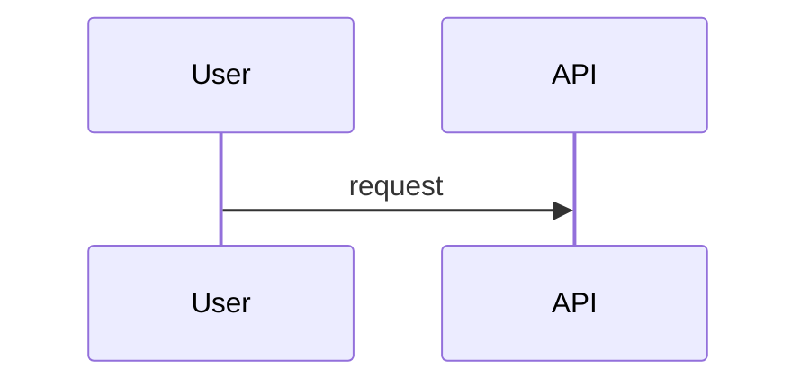

# Tiny-Chu HOW TO USE

이 문서는 Tiny-Chu를 OpenCode 플러그인으로 붙여서 작은 로컬 모델이 전체 작업을 잃지 않고, 큰 분석 작업은 큰 워커 모델에 위임하며, 설계 산출물을 근거 기반으로 작성하는 운용 방법을 정리한다.

대상 환경은 Windows 10, PowerShell 7.6, OpenCode, Ollama `gemma4-small` 오케스트레이터, `qwen3.6-35b-a3b` 분석 워커 조합이다.

## 1. 기본 구조

Tiny-Chu는 큰 에이전트 프레임워크가 아니라 작은 파일 기반 오케스트레이션 플러그인이다. 작은 모델이 직접 모든 파일을 읽고 기억하려고 하지 않도록 아래 역할만 제공한다.

- 프로젝트 규칙과 `AGENTS.md`를 모아 컨텍스트 번들을 만든다.
- `.tiny/tasks/`에 작업 상태와 checkpoint를 저장한다.
- `.tiny/plans/`의 Markdown checkbox 계획을 읽어 이어서 할 일을 판단한다.
- `.tiny/public-jobs/`에 큰 워커 모델용 작업 패킷을 저장한다.
- `.tiny/wiki/index.json`을 기준으로 canonical wiki 문서를 묶는다.
- OpenCode 도구로 task, context, wiki, public job, artifact, Mermaid 검증 기능을 노출한다.

작은 모델은 기억에 의존하지 말고 `tool_usage_plan`, `repo_map`, `task_checkpoint`, `resume_packet`, `context_digest`, `artifact_check`를 반복해서 사용해야 한다.

## 2. OpenCode 적용

이 리포지토리는 이미 프로젝트 로컬 OpenCode 플러그인 shim을 포함한다.

```text
.opencode/
  package.json
  plugins/
    tiny-chu.ts
```

로컬 shim은 다음 TypeScript plugin adapter를 export한다.

```ts
export { TinyChuOpenCodePlugin as TinyChu } from "../../src/opencode/plugin.ts";
```

이 리포지토리 루트에서 OpenCode를 실행하면 `.opencode/plugins/tiny-chu.ts`가 로드되어 Tiny-Chu 도구가 활성화된다.

다른 프로젝트에서 쓰려면 대상 프로젝트에 아래 파일을 둔다.

```json
{
  "private": true,
  "type": "module",
  "dependencies": {
    "@opencode-ai/plugin": "^1.17.4",
    "tiny-chu": "file:/absolute/path/to/Tiny-Chu"
  }
}
```

```ts
export { TinyChuOpenCodePlugin as TinyChu } from "tiny-chu/opencode";
```

빌드 후 entrypoint smoke test:

```powershell
npm run build
node --input-type=module -e "import { TinyChuOpenCodePlugin } from './dist/opencode/plugin.js'; console.log(typeof TinyChuOpenCodePlugin)"
```

기대값은 `function`이다.

## 3. 권장 에이전트 구성

Tiny-Chu는 모델 라우터 자체가 아니라 OpenCode 플러그인 도구를 제공한다. 모델 배정은 OpenCode 쪽 설정에서 하되, 아래 역할을 기준으로 나눈다.

| 에이전트 | 권장 모델 | 책임 | 사용 도구 |
| --- | --- | --- | --- |
| `tiny-foreman` | Ollama `gemma4-small` | 목표 유지, 계획 분해, checkpoint, 근거 수집 요청, 워커 위임 | `tool_usage_plan`, `legacy_repo_index`, `ui_action_trace`, `api_backend_trace`, `integration_catalog`, `traceability_matrix`, `evidence_qa`, `task_*`, `resume_packet`, `context_digest`, `public_dispatch`, `public_collect`, `qwen_retry_policy`, `orchestration_health`, `chunked_write_plan` |
| `repo-analyst` | `qwen3.6-35b-a3b` | 소스 구조 분석, AS-IS, 위험 분석, 설계 판단 | `repo_map`, `business_logic_map`, `legacy_repo_index`, `fd`, `rg`, `ast-grep`, `context_digest`, `artifact_check` |
| `artifact-architect` | `qwen3.6-35b-a3b` | UI 정의서, 사용자 스토리, TestCase, ERD 초안 작성 | `public_dispatch`, `wiki_bundle`, `artifact_check`, `chunked_write_plan` |
| `mermaid-reviewer` | small 또는 large | sequence, flowchart, ERD Mermaid 문법 검토 | `mdq`, `mermaid_check`, `mermaid_fix`, `mmdc` |
| `qa-reviewer` | large 권장 | 산출물의 근거 누락, 환각, 미검증 주장 검토 | `artifact_check`, `rg`, `jq`, `task_checkpoint` |
| `doc-writer` | small 가능 | 긴 Markdown 산출물 chunk 단위 작성 | `chunked_write_plan`, `artifact_check`, `mermaid_check` |

### 에이전트 운용 규칙

- `tiny-foreman`은 먼저 `tool_usage_plan`으로 다음 도구 순서를 받고, 파일 전체를 읽기 전에 `repo_map`, `fd`, `rg`, `ast-grep`로 후보를 줄인다.
- Button to API to Backend to DB/RFC 분석은 `legacy_repo_index` 이후 `ui_action_trace`, `api_backend_trace`, `integration_catalog`, `traceability_matrix`, `evidence_qa` 순서로 진행한다.
- 복잡한 business logic, 변수 관계, 컬럼 비교를 설명하기 전에는 `business_logic_map`을 먼저 호출한다.
- repo 사실을 말하기 전에 `context_digest`로 line citation을 확보한다.
- 큰 분석은 `public_dispatch`로 워커 패킷을 만들고, 워커 응답은 `public_collect`로 가져온다.
- Qwen 워커는 공용 제한이 있으므로 `qwen_retry_policy`의 20 requests/min, 20000 tokens/min 정책을 기준으로 분할과 retry를 계산한다.
- 워커에게 보낼 packet에는 `objective`, `artifactType`, `boundedFiles`, `evidenceRefs`, `knownUncertainties`, `mustReturn`을 포함한다.
- 워커 결과는 바로 믿지 말고 `artifact_check`, `mermaid_check`, `rg` 근거 재확인 후 checkpoint한다.
- 긴 Markdown은 한 번에 쓰지 말고 `chunked_write_plan`으로 쪼개서 작성한다.
- 실패, retry wait, compaction 이후에는 `orchestration_health`와 `resume_packet`을 확인한다.
- 구조 패턴을 확인한 뒤에는 `rules_snapshot`으로 `.tiny/rules/architecture-patterns.md`를 갱신한다.

## 4. 설치해야 할 command

PowerShell에서는 alias 대신 실제 native executable 이름을 사용한다.

| Command | 목적 | 권장 예시 |
| --- | --- | --- |
| `fd` | 파일 inventory | `fd --type f --hidden --exclude .git --exclude node_modules --exclude dist` |
| `rg` | text evidence 검색 | `rg --json --line-number --column --no-heading 'createTinyInfiPlugin' src` |
| `ast-grep` | TypeScript 구조 검색 | `ast-grep run --lang ts -p 'export function $NAME($$$ARGS)' src` |
| `jq` | JSON slicing | `jq -c '.scripts' package.json` |
| `yq` | YAML/JSON 변환 | `yq -o json '.dependencies' package.json` |
| `mdq` | Markdown heading, checkbox, code fence 추출 | `mdq --output json '# Usage' HOW_TO_USE.md` |
| `mmdc` | Mermaid 실제 renderer 검증 | `mmdc -i diagram.mmd -o diagram.svg` |
| `node` / `npm` | 빌드와 테스트 | `npm run build`, `npm test` |

PowerShell 안전 규칙:

- jq/yq/mdq/rg/fd/ast-grep pattern은 작은따옴표로 감싼다.
- `$`, `[]`, `{}`, `|`, backtick이 들어간 filter를 큰따옴표로 감싸지 않는다.
- native tool의 위치 인자가 `-`로 시작하면 tool 자체의 `--` separator를 사용한다.
- bash 전용 문법인 here-document, process substitution, `xargs -0`, `VAR=value command`를 쓰지 않는다.
- JSON 출력이 가능하면 text parsing 대신 `--json`, `-o json`, `-c`를 사용한다.

권장 PowerShell session 초기화:

```powershell
$PSNativeCommandArgumentPassing = 'Standard'
$env:NO_COLOR = '1'
$env:FD_OPTIONS = '--color=never'
Remove-Item Env:RIPGREP_CONFIG_PATH -ErrorAction SilentlyContinue
```

## 5. Tiny-Chu 도구 전체 사용법

OpenCode에서는 아래 이름의 도구가 노출된다. 라이브러리에서 직접 사용할 때는 `createTinyInfiPlugin()`의 `tiny.tools.<name>()`를 호출한다.

### 작업 상태 도구

| Tool | 언제 쓰나 | 핵심 input |
| --- | --- | --- |
| `task_create` | 새 분석/설계 작업 시작 | `title`, `priority`, `notes`, `planRef` |
| `task_get` | 특정 task 조회 | `id` |
| `task_list` | 상태별 task 목록 | `status` |
| `task_update` | title/status/priority/evidence 갱신 | `id`, `status`, `evidenceRefs` |
| `task_checkpoint` | pass 종료, 위임 전후, 중단 전 상태 저장 | `id`, `summary`, `artifactType`, `passIndex`, `nextSteps`, `evidenceRefs`, `openQuestions`, `verificationCommands` |
| `resume_packet` | session 시작, compaction 이후, 중단 복구 | `id` |

예시:

```ts
const task = await tiny.tools.task_create({
  title: "Analyze payment module",
  priority: "high",
});

await tiny.tools.task_checkpoint({
  id: task.id,
  summary: "Found entry points and unresolved auth question",
  artifactType: "as_is",
  passIndex: 1,
  nextSteps: ["scan controller routes", "ask repo-analyst for sequence"],
  evidenceRefs: ["rg://payment", "src/payment/service.ts:42"],
  openQuestions: ["which role owns refund approval?"],
  verificationCommands: ["rg --json 'refund' src/payment"],
});

const packet = await tiny.tools.resume_packet({ id: task.id });
```

### 컨텍스트 도구

| Tool | 언제 쓰나 | 결과 |
| --- | --- | --- |
| `context_bundle` | `AGENTS.md`, `.tiny/rules`, `.claude/rules`, `.cursor/rules`, `.github/instructions`를 모을 때 | project rule bundle |
| `context_digest` | 큰 파일에서 특정 query line 근거만 뽑을 때 | bounded snippets, citations, truncated |
| `repo_map` | architecture, web button, API handler, database write 후보를 작게 맵핑할 때 | bounded layers, files, dataFlowHints, recommendedCommands |
| `business_logic_map` | business rule의 변수, 컬럼, 비교식을 상세히 보되 파일 전체를 모델에 넣지 않을 때 | variables, columns, comparisons, evidence |
| `legacy_repo_index` | React/Redux-Saga/Axios/Java/MyBatis/RFC 후보를 evidence id와 함께 색인할 때 | facts, detectedFrameworks, inventoryMarkdown |
| `ui_action_trace` | button/link/menu 이벤트를 handler/action/saga/API로 추적할 때 | rows, evidence, Unknown gaps |
| `api_backend_trace` | FE API method/path를 BE route/service/mapper/RFC로 추적할 때 | matched/unmatched endpoint, service, integration |
| `integration_catalog` | MyBatis SQL과 SAP RFC 호출을 분리 cataloging할 때 | dbCatalog, rfcCatalog |
| `traceability_matrix` | UI에서 DB/RFC까지 한 줄 matrix로 병합할 때 | JSON rows, Markdown table |
| `evidence_qa` | 산출물 publish 전 근거 누락과 hallucinated symbol을 차단할 때 | blockers, warnings, required fixes |
| `wiki_bundle` | `.tiny/wiki/index.json` 기준 canonical 문서를 가져올 때 | selected wiki docs |
| `orchestration_profile` | small-context 운영 규칙을 모델에게 주입할 때 | foreman/delegate/tool/audit/artifact profile |
| `tool_usage_plan` | 어떤 command/tool을 다음에 써야 할지 모델이 불확실할 때 | ordered steps, command budgets, stop rules |
| `qwen_retry_policy` | Qwen public worker가 rate limit, timeout, network failure에 걸렸을 때 | limits, retry delays, minimum batches, recovery protocol |
| `orchestration_health` | 중단, 실패, retry wait 이후 복구 상태를 점검할 때 | task/job counts, retryable jobs, recovery steps |
| `rules_snapshot` | 확인한 구현 패턴을 추후 작업 rules로 남길 때 | `.tiny/rules/architecture-patterns.md` |

`context_digest` 예시:

```ts
const digest = await tiny.tools.context_digest({
  targetPath: "src/opencode/plugin.ts",
  query: "context_digest",
  maxSnippetChars: 160,
  maxSnippets: 8,
});
```

작은 모델은 `digest.citations`에 있는 `file:line`만 근거로 주장해야 한다.

`business_logic_map` 예시:

```ts
const logic = await tiny.tools.business_logic_map({
  targetPath: "src",
  maxFiles: 80,
  maxItemsPerFile: 12,
});
```

결과의 `variables`, `columns`, `comparisons`는 business rule 설명의 입력이다. 모델은 이 JSON을 기준으로 비교 관계를 말하고, 필요한 경우 `context_digest`로 해당 line만 추가 확인한다.

### public worker 도구

| Tool | 언제 쓰나 |
| --- | --- |
| `public_dispatch` | 큰 워커에게 분석/설계/산출물 초안 작업 패킷을 큐잉 |
| `public_collect` | 워커 결과 확인 |
| `public_checkpoint` | 워커가 부분 결과를 냈거나 긴 작업 중단 전 상태를 저장 |
| `public_retry` | rate gate 또는 실패 작업 재시도 |
| `public_cancel` | 잘못된 작업 취소 |

워커 packet 예시:

```ts
await tiny.tools.public_dispatch({
  taskId: task.id,
  prompt: [
    "Act as repo-analyst.",
    "Produce AS-IS analysis for payment module.",
    "Use only supplied evidence refs.",
  ].join("\n"),
  artifactType: "as_is",
  rulesRefs: ["AGENTS.md"],
  wikiRefs: ["architecture/payment"],
  mustReturn: [
    "artifactMarkdown",
    "citations",
    "uncertainties",
    "verificationCommands",
    "nextSteps",
  ],
  checkpointSummary: "delegated bounded AS-IS analysis to repo-analyst",
});
```

Qwen 공용 모델 제한:

- 모델: `qwen3.6-35b-a3b`
- 요청 제한: 20 requests/min
- 토큰 제한: 20000 tokens/min
- 기본 요청 간격: 3000 ms 이상
- 실패 시 중단 금지: `task_checkpoint`와 `public_checkpoint`로 부분 결과를 저장하고 `qwen_retry_policy`와 `public_retry`로 재개한다.

Retry 예시:

```ts
const retry = await tiny.tools.qwen_retry_policy({
  estimatedTokens: 45000,
  attempt: 2,
  status: "rate_limited",
});

await tiny.tools.task_checkpoint({
  id: task.id,
  summary: "Qwen worker hit rate limit; saved partial evidence before retry",
  nextSteps: ["wait according to qwen_retry_policy", "public_retry the failed job"],
  evidenceRefs: ["qwen_retry_policy:20rpm-20000tpm"],
});
```

### 산출물 검증 도구

| Tool | 언제 쓰나 |
| --- | --- |
| `artifact_check` | AS-IS, UI 정의서, sequence, flowchart, user story, test case, ERD를 수락하기 전 |
| `mermaid_check` | Mermaid fence, declaration, obvious syntax 문제를 확인 |
| `mermaid_fix` | `Mermaid` fence 대소문자, 닫히지 않은 fence 같은 deterministic 문제 수정 |

지원 artifact type:

- `as_is`
- `ui_definition`
- `sequence_diagram`
- `flowchart`
- `user_story`
- `test_case`
- `erd`

`artifact_check` 예시:

```ts
const result = await tiny.tools.artifact_check({
  artifactType: "as_is",
  markdown: "## Evidence\n- src/index.ts:1\n\n## Current Behavior\n...\n\n## Risks\n...",
  evidenceRefs: ["src/index.ts:1"],
});
```

Mermaid-backed artifact는 fenced Mermaid block이 필요하다.

````markdown

````

`mmdc`가 설치되어 있으면 최종 산출 전 실제 renderer도 돌린다.

```powershell
mmdc -i .tiny/tmp/sequence.mmd -o .tiny/tmp/sequence.svg
```

### 긴 파일 쓰기 도구

긴 Markdown 산출물은 작은 모델이 중간에 목표를 잃거나 쓰기 시간이 길어지기 쉽다. 먼저 `chunked_write_plan`으로 분할한다.

```ts
const writePlan = await tiny.tools.chunked_write_plan({
  path: "docs/AS_IS.md",
  markdown: artifactMarkdown,
  maxChunkChars: 2000,
});
```

운용 규칙:

- chunk index 순서대로 쓴다.
- 각 chunk 작성 후 파일 tail 또는 checksum을 확인한다.
- 전체 작성 후 `artifact_check`와 `mermaid_check`를 다시 실행한다.
- 실패하면 마지막 정상 chunk 이후부터 재개한다.

## 6. 표준 분석 워크플로우

### 6.1 시작

1. `task_create`로 작업을 만든다.
2. `context_bundle`로 적용 규칙을 가져온다.
3. `orchestration_profile`로 모델 역할과 command 규칙을 확인한다.
4. `tool_usage_plan`으로 작은 모델이 실행할 최소 tool sequence를 정한다.
5. `repo_map`으로 architecture와 UI/API/database 후보 흐름을 만든다.
6. `task_checkpoint`에 초기 목표, 산출물 타입, open question을 저장한다.

### 6.2 evidence map 만들기

PowerShell 예시:

```powershell
fd --type f --hidden --exclude .git --exclude node_modules --exclude dist
rg --json --line-number --column --no-heading 'createTinyInfiPlugin' src test
ast-grep run --lang ts -p 'export function $NAME($$$ARGS)' src
jq -c '.exports' package.json
mdq --output json '# Small-model resilience tools' README.md
```

작은 모델은 command 결과 전체를 오래 들고 있지 말고 다음 구조로 줄인다.

```json
{
  "objective": "Find plugin tool surface",
  "evidenceRefs": [
    "src/opencode/plugin.ts:15",
    "src/opencode/tiny-plugin.ts:132",
    "README.md:53"
  ],
  "uncertainties": [
    "Need to confirm OpenCode runtime load path in target project"
  ]
}
```

### 6.3 큰 워커에게 위임

`tiny-foreman`은 워커에게 repo 전체를 던지지 않는다. 아래 packet만 보낸다.

```json
{
  "role": "repo-analyst",
  "objective": "Produce AS-IS for Tiny-Chu OpenCode tool surface",
  "artifactType": "as_is",
  "boundedFiles": [
    "src/opencode/plugin.ts",
    "src/opencode/tiny-plugin.ts",
    "README.md"
  ],
  "evidenceRefs": [
    "src/opencode/plugin.ts:15",
    "src/opencode/tiny-plugin.ts:132"
  ],
  "knownUncertainties": [
    "Target OpenCode project may use a different plugin installation path"
  ],
  "mustReturn": [
    "artifactMarkdown",
    "citations",
    "uncertainties",
    "verificationCommands",
    "nextSteps"
  ]
}
```

### 6.4 산출물 작성

각 산출물은 아래 기준으로 만든다.

| Artifact | 필수 근거 |
| --- | --- |
| AS-IS | entry point, 주요 module, 현재 흐름, risk |
| UI 정의서 | screens, states, interactions, source evidence |
| Sequence Diagram | workflow evidence, `sequenceDiagram` block |
| FlowChart | decision evidence, `flowchart` 또는 `graph` block |
| User Story | story, acceptance criteria, evidence |
| TestCase | precondition, action, expected result, evidence |
| ERD | schema/source evidence, `erDiagram` block |

완성 전 체크:

```ts
await tiny.tools.artifact_check({
  artifactType: "flowchart",
  markdown,
  evidenceRefs,
});

await tiny.tools.mermaid_check({ markdown });
```

### 6.5 checkpoint와 재개

작은 모델은 아래 상황마다 checkpoint한다.

- 파일 inventory가 끝났을 때
- 큰 워커에게 위임하기 직전
- 워커 결과를 받았을 때
- 산출물 chunk 하나를 썼을 때
- Mermaid 또는 artifact validation 결과가 나왔을 때
- session compaction 또는 긴 command 전에

재개할 때는 `resume_packet`만 먼저 본다. 기억으로 이어가지 않는다.

```ts
const resume = await tiny.tools.resume_packet({ id: taskId });
```

## 7. 20-pass 개선 루프

복잡한 설계 분석은 한 번에 완성하려고 하지 말고 20회까지 작은 pass로 반복한다.

각 pass는 다음 순서를 따른다.

1. `resume_packet`으로 현재 목표와 마지막 checkpoint를 확인한다.
2. `fd`, `rg`, `ast-grep`, `jq`, `yq`, `mdq` 중 하나로 근거를 갱신한다.
3. `context_digest`로 필요한 line citation을 만든다.
4. 산출물 하나 또는 section 하나만 개선한다.
5. `artifact_check`와 `mermaid_check`를 실행한다.
6. `task_checkpoint`에 `passIndex`, `summary`, `evidenceRefs`, `nextSteps`, `openQuestions`, `verificationCommands`를 저장한다.

pass 하나가 너무 크면 실패한 것이다. 작은 모델이 한 turn 안에 끝낼 수 있는 단위로 줄인다.

## 8. 추천 skill 운용

OpenCode 또는 Codex에서 별도 skill system을 쓸 수 있다면 아래 역할을 연결한다.

| Skill | 사용 시점 |
| --- | --- |
| `ulw-loop` | 긴 목표, evidence ledger, checkpoint, manual QA가 필요할 때 |
| `programming` | TypeScript, Python, Go, Rust 코드 변경이 있을 때 |
| `lsp` | 정의 이동, 참조 확인, diagnostics가 필요할 때 |
| `lsp-setup` | target repo에 language server가 없을 때 |
| `debugging` | 런타임 실패, stuck process, 이상 응답을 분석할 때 |
| `review-work` | 큰 변경 후 reviewer 승인이 필요할 때 |
| `visual-qa` | UI 산출물 또는 화면 변경을 실제 screenshot으로 확인할 때 |
| `git-master` | commit, blame, history, bisect, PR 전 정리가 필요할 때 |

작은 모델은 skill 내용을 길게 기억하려고 하지 말고, 필요한 순간에 해당 skill의 체크리스트만 가져와야 한다.

## 9. 추천 command recipe

### TypeScript API surface 찾기

```powershell
fd --type f --extension ts . src
rg --json --line-number --column --no-heading 'export .*createTinyInfiPlugin|TinyChuOpenCodePlugin|tool\\(' src
ast-grep run --lang ts -p 'export const $NAME = $VALUE' src
```

### package와 plugin export 확인

```powershell
jq -c '.exports' package.json
jq -r '.scripts.test' package.json
node --input-type=module -e "import { TinyChuOpenCodePlugin } from './dist/opencode/plugin.js'; console.log(typeof TinyChuOpenCodePlugin)"
```

### Markdown 계획 상태 확인

```powershell
mdq --output json '- [ ]' .tiny/plans/PLAN.md
mdq --output json '- [x]' .tiny/plans/PLAN.md
```

### Mermaid 검증

```powershell
mdq --output json '```mermaid' docs/DESIGN.md
mmdc -i .tiny/tmp/diagram.mmd -o .tiny/tmp/diagram.svg
```

### JSON 상태 확인

```powershell
fd --type f . .tiny/tasks
jq -c '{id,title,status,priority,updatedAt}' .tiny/tasks/*.json
```

## 10. 산출물 수락 기준

산출물을 수락하려면 아래 조건을 만족해야 한다.

- 모든 주요 주장에 `file:line`, command transcript, 또는 `evidenceRef`가 있다.
- `artifact_check`가 valid를 반환한다.
- Mermaid 산출물은 `mermaid_check`가 valid이고, 가능하면 `mmdc` 렌더링도 통과한다.
- open question은 추측으로 채우지 않고 `openQuestions`에 남긴다.
- 최종 checkpoint에 다음 행동과 검증 command가 들어 있다.

## 11. 실패했을 때 복구

| 증상 | 복구 |
| --- | --- |
| 작은 모델이 목표를 잃음 | `resume_packet` 호출 후 latest checkpoint의 `nextSteps`만 수행 |
| 파일을 너무 많이 읽음 | `fd`/`rg`로 후보 축소 후 `context_digest`만 사용 |
| 긴 Markdown 작성 중 멈춤 | `chunked_write_plan`의 마지막 성공 chunk 이후부터 재개 |
| Mermaid fence가 깨짐 | `mermaid_fix` 후 `mermaid_check`, 가능하면 `mmdc` |
| 워커 결과가 그럴듯하지만 근거가 없음 | `artifact_check` 실패 처리, evidenceRefs를 요구해 재위임 |
| Qwen 공용 limit에 걸림 | `qwen_retry_policy`로 wait/chunk 계산, `task_checkpoint` 후 `public_retry` |
| worker job이 checkpointed/failed/retry_wait에서 멈춤 | `orchestration_health`로 retryable job 확인 후 `public_retry` |
| business logic 설명이 변수/컬럼 근거 없이 길어짐 | `business_logic_map`으로 비교식 JSON을 만든 뒤 필요한 line만 `context_digest` |
| 같은 구현 패턴을 계속 다시 설명함 | `rules_snapshot`으로 `.tiny/rules/architecture-patterns.md` 갱신 |
| PowerShell command가 이상하게 해석됨 | 작은따옴표, native executable, `$PSNativeCommandArgumentPassing = 'Standard'` 확인 |

## 12. 최소 운영 루틴

1. OpenCode를 repository root에서 시작한다.
2. `orchestration_profile`을 확인한다.
3. `task_create`로 목표를 만든다.
4. `tool_usage_plan`으로 다음 도구 순서를 고정한다.
5. `repo_map`으로 architecture와 web-to-database flow 후보를 만든다.
6. `business_logic_map`으로 변수, 컬럼, 비교식을 작게 추출한다.
7. `context_bundle`과 command recipe로 evidence map을 만든다.
8. `context_digest`로 필요한 line citation만 확보한다.
9. 큰 분석은 `qwen_retry_policy` 제한을 확인한 뒤 `public_dispatch`로 `repo-analyst` 또는 `artifact-architect`에게 위임한다.
10. 실패 또는 중단 시 `orchestration_health`, `resume_packet`, `public_retry` 순서로 복구한다.
11. 결과는 `artifact_check`, `mermaid_check`, `mmdc`로 검증한다.
12. 긴 문서는 `chunked_write_plan`으로 작성한다.
13. 확인한 architecture 구현 패턴은 `rules_snapshot`으로 `.tiny/rules`에 기록한다.
14. 매 pass마다 `task_checkpoint`를 남긴다.
15. 중단 후에는 `resume_packet`으로만 재개한다.
