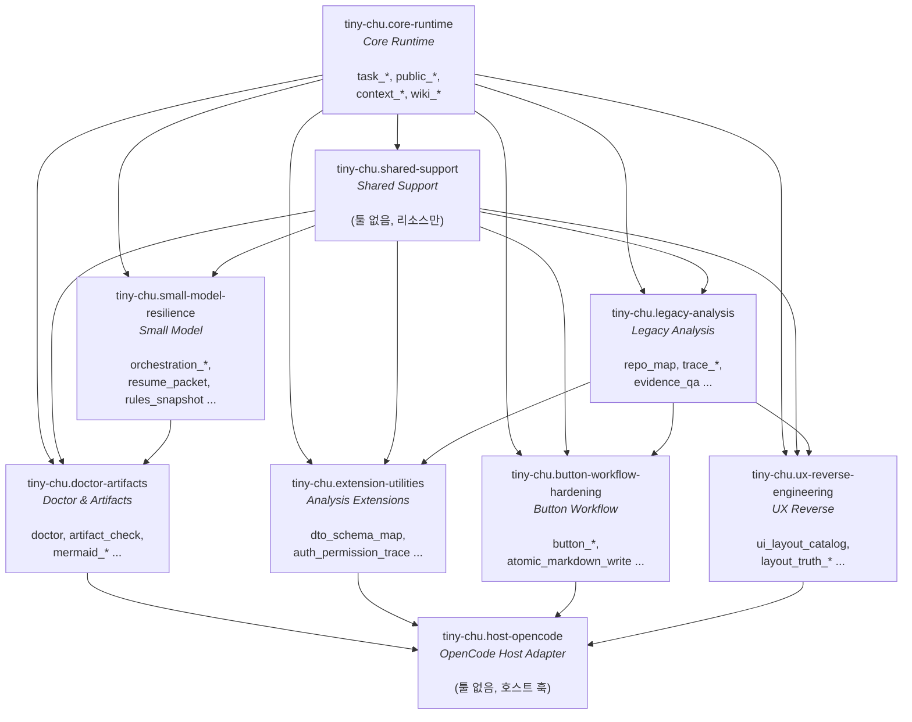

# 03. Feature Package 시스템

> [02-registry-pattern.md](./02-registry-pattern.md)에서 레지스트리 패턴의 큰 그림을 봤습니다. 여기서는 그 레지스트리를 채우는 **패키지 디스크립터**와 **의존성 그래프**를 세세하게 다룹니다.

## 패키지란 무엇인가

`TinyFeaturePackage`(`feature-package-types.ts:90`)는 관련 툴들을 하나로 묶는 **선언적 디스크립터**입니다:

```ts
export interface TinyFeaturePackage {
  readonly id: string;              // 예: "tiny-chu.core-runtime"
  readonly version: 1;              // 매니페스트 버전 (현재 1로 고정)
  readonly title: string;           // 사람이 읽는 제목
  readonly category: TinyFeatureCategory;
  readonly dependsOn?: readonly string[];   // 다른 패키지 id에 대한 의존성
  readonly compatibility?: TinyCompatibilitySpec;
  readonly tools?: readonly TinyToolDescriptor[];        // 핵심: 툴 목록
  readonly resources?: readonly TinyResourceDescriptor[];
  readonly prompts?: readonly TinyPromptDescriptor[];
  readonly instructions?: readonly TinyInstructionDescriptor[];
  readonly hooks?: TinyFeatureHooks;
}
```

중요한 점: 패키지는 **메타데이터와 툴 디스크립터의 모음**이지, 코드를 캡슐화하는 모듈이 아닙니다. 실제 핸들러 구현은 `tiny-plugin.ts`의 평평한 맵에 있고, 패키지는 그 핸들러들을 **이름으로 참조**하여 바인딩합니다([02](./02-registry-pattern.md)의 단계 2 참조).

## 카테고리

`TinyFeatureCategory`(`feature-package-types.ts:3`)는 9개 값을 가집니다:

| 카테고리 | 의미 |
|---------|------|
| `core-runtime` | 핵심 상태 원시 기능 (task, public job, context, wiki) |
| `legacy-analysis` | 레거시 코드 추적성 분석 (FE→BE→DB→RFC) |
| `extension-utilities` | 분석 확장 도구 |
| `workflow-hardening` | 버튼 워크플로 강화 |
| `small-model-resilience` | 소형 모델 복원력 도구 |
| `safe-tooling` | (옵션) 해시 검증 소스 변경 도구 |
| `ux-reverse-engineering` | UX 역설계 |
| `doctor-artifacts` | 준비 게이트와 산출물 가드 |
| `support` | 공유 지원 / 호스트 어댑터 |

## 기본 패키지 그래프 (9개)

`DEFAULT_PACKAGE_SEEDS`(`default-package-seeds.ts:4`)는 항상 포함되는 9개 패키지를 정의합니다. 의존성 관계는 다음과 같습니다:



### 패키지별 상세

| 패키지 id | 카테고리 | dependsOn | 툴 수 | 역할 |
|-----------|---------|-----------|-------|------|
| `tiny-chu.core-runtime` | core-runtime | (없음, 루트) | 15 | task/public/context/wiki 원시 기능. 다른 모든 패키지의 기반 |
| `tiny-chu.shared-support` | support | core-runtime | **0** | 툴 없음. 공유 스캐너·마크다운·PowerShell 헬퍼를 **리소스로** 선언만. 다른 패키지가 의존하는 경계 규칙 담당 |
| `tiny-chu.legacy-analysis` | legacy-analysis | core-runtime, shared-support | 8 | FE→BE→DB→RFC 추적성 (repo_map, trace, evidence_qa) |
| `tiny-chu.extension-utilities` | extension-utilities | +legacy-analysis | 11 | dto_schema_map, auth_permission_trace, worker_packet_optimizer 등 심층 분석 |
| `tiny-chu.button-workflow-hardening` | workflow-hardening | +legacy-analysis | 10 | 버튼별 워크플로, 원자적 마크다운 쓰기 |
| `tiny-chu.small-model-resilience` | small-model-resilience | core-runtime, shared-support | 11 | orchestration_profile, resume_packet, git_weekly_report 등 |
| `tiny-chu.ux-reverse-engineering` | ux-reverse-engineering | +legacy-analysis | 7 | ui_layout_catalog, layout_truth_* |
| `tiny-chu.doctor-artifacts` | doctor-artifacts | +small-model-resilience | 9 | doctor, artifact_check, mermaid_check/fix |
| `tiny-chu.host-opencode` | support | doctor, ext, button, ux | **0** | 툴 없음. OpenCode 호스트 훅(beforeRun) 선언. **위상 정렬의 끝(leaf)** |

> **`shared-support`과 `host-opencode`는 툴이 0개입니다.** 둘 다 `support` 카테고리이지만 역할이 다릅니다:
> - `shared-support`는 의존성 그래프의 **중간 허브** — 다른 분석 패키지들이 공통으로 의존하는 경계 규칙을 표현.
> - `host-opencode`는 그래프의 **종단(terminal)** — 모든 기능 패키지가 컴포즈된 뒤 호스트 어댑터가 그 결과를 소비함을 선언.

## 옵션 패키지 (safe tooling, 2개)

`SAFE_TOOLING_PACKAGE_SEEDS`(`default-package-seeds.ts:89`)는 `config.safeTooling: true`일 때만 포함됩니다:

| 패키지 id | 카테고리 | dependsOn | 조건 |
|-----------|---------|-----------|------|
| `tiny-chu.safe-tooling` | safe-tooling | core-runtime, shared-support | `safeTooling: true` |
| `tiny-chu.native-previews` | safe-tooling | safe-tooling | `safeTooling: true && nativePreviews: true` |

`default-packages.ts:12`의 포함 로직:

```ts
const seeds = options.safeTooling === true
  ? [...DEFAULT_PACKAGE_SEEDS, ...SAFE_TOOLING_PACKAGE_SEEDS.filter(
      (seed) => seed.id !== "tiny-chu.native-previews" || options.nativePreviews === true
    )]
  : DEFAULT_PACKAGE_SEEDS;
```

> **기본 레지스트리는 불변**입니다. `safeTooling`을 켜지 않으면 safe-patch, artifact-publish, native-preview 툴은 레지스트리에 존재하지 않습니다. 이것은 "안전한 소스 변경 도구는 옵트인"이라는 설계 원칙입니다 ([08-design-decisions.md](./08-design-decisions.md) 참조).

## ToolSeed: 디스크립터의 작은 빌딩 블록

패키지의 툴은 `ToolSeed`(`tool-seed.ts:3`)로 정의됩니다. 이것은 `TinyToolDescriptor`에서 `handler`만 빠진 형태입니다:

```ts
export type ToolSeed = Omit<TinyToolDescriptor, "handler">;
```

`tool-seed.ts`는 반복을 줄이는 **헬퍼 팩토리**를 제공합니다:

| 팩토리 | permission | smallModel | 용도 |
|-------|-----------|-----------|------|
| `readJson(name, desc, natives?)` | `{readOnly: true, network: "none"}` | `{outputMode: "json", deterministic: true}` | 읽기 전용 JSON 툴 |
| `writeState(name, desc)` | `{writesState: true, network: "none"}` | JSON hint | `.tiny/` 상태 쓰기 |
| `writeMarkdown(name, desc)` | `{writesArtifacts: true, ...}` | markdown hint | 산출물 쓰기 |
| `writeSource(name, desc)` | `{writesSource: true, ...}` | JSON hint | 소스 쓰기 (safe-tooling만) |
| `markdown(name, desc)` | readOnly + markdown hint | | 읽기 전용 markdown 렌더 |

`requiredNativeTools` (예: `["fd", "rg", "ast-grep"]`)를 지정하면, 컴포저가 이를 모아 `registry.nativeToolNames`에 추가합니다. 이 정보는 install-check와 environment_doctor가 "이 툴을 쓰려면 어떤 네이티브 실행 파일이 필요한가"를 알려주는 근거가 됩니다.

### `default-tool-seeds.ts` 예시

```ts
export const LEGACY_ANALYSIS_TOOLS: readonly ToolSeed[] = [
  readJson("repo_map", "Build a bounded architecture ... map.", ["fd", "rg"]),
  readJson("business_logic_map", "...", ["rg", "ast-grep"]),
  readJson("legacy_repo_index", "...", ["fd", "rg", "ast-grep", "jq", "yq"]),
  // ...
];
```

각 툴의 `requiredNativeTools`가 다릅니다. `legacy_repo_index`는 5개 네이티브 툴이 필요하지만 `traceability_matrix`는 0개입니다. 이 메타데이터가 environment_doctor의 진단 정확도를 뒷받침합니다.

## 호환성 스펙 (compatibility)

각 패키지는 `TinyCompatibilitySpec`(`feature-package-types.ts:41`)을 가져, 설치 환경 요구사항을 선언합니다:

```ts
export interface TinyCompatibilitySpec {
  readonly manifestVersion: 1;
  readonly packageVersion: string;        // "0.1.0"
  readonly hostApiVersion: "opencode-plugin-v1";
  readonly dependsOn: readonly string[];
  readonly requiredTools: readonly string[];   // 자기 패키지의 툴명
  readonly optionalHooks: readonly string[];
  readonly requiredRuntime: {
    readonly windows10: boolean;
    readonly powershell: "5.1" | "7.6" | "5.1+";
    readonly opencode: boolean;
  };
}
```

`default-packages.ts:28`에서 모든 기본 패키지는 `windows10: true`, `powershell: "7.6"`, `opencode: true`를 요구합니다. 이 스펙은 현재 메타데이터로만 쓰이지만(강제 검사는 아직 없음), 향후 설치 게이트의 기반입니다.

## 위상 정렬 알고리즘 상세

`feature-package-order.ts:47`의 `topologicalOrder()`는 Kahn의 알고리즘을 씁니다:

```text
1. 각 패키지의 진입 차수(indegree) 계산: dependsOn 개수만큼 증가
2. dependents 맵 구성: "내가 의존하는 패키지 → 나를 의존하는 패키지들"
3. ready 큐 = indegree 0인 패키지들 (정렬)
4. while ready가 비어있지 않음:
     a. ready에서 첫 패키지 꺼내 → ordered에 추가
     b. 그 패키지의 dependents들의 indegree 감소
     c. indegree가 0이 된 dependent를 ready에 추가 (정렬 유지)
5. ordered.length ≠ 전체 패키지 수 → 사이클 존재 → dependency_cycle 에러
```

**결정성의 핵심**: `ready` 큐와 `dependents`를 조작할 때마다 `.sort()`를 호출합니다 (`:62`, `:68`, `:73`). 동일한 디스크립터 집합은 항상 동일한 `orderedIds`를 생성합니다. 이것이 테스트가 정확한 순서를 단언(assert)할 수 있는 이유입니다.

### 실제 정렬 결과 (기본 9패키지)

의존성 그래프를 위상 정렬하면 대략 다음 순서가 됩니다 (동일 indegree 내에서는 id 알파벳순):

```text
1. tiny-chu.core-runtime          (indegree 0, 루트)
2. tiny-chu.shared-support        (core만 의존)
3. tiny-chu.legacy-analysis       (core + support)
4. tiny-chu.small-model-resilience (core + support)
5. tiny-chu.button-workflow-hardening
6. tiny-chu.extension-utilities
7. tiny-chu.ux-reverse-engineering
8. tiny-chu.doctor-artifacts      (small-model-resilience 의존)
9. tiny-chu.host-opencode         (마지막, 모든 기능 패키지 의존)
```

> 정확한 순서는 동점(tie) 처리에 따라 달라질 수 있지만, **core-runtime이 항상 1번, host-opencode가 항상 마지막**이라는 제약은 의존성 그래프가 보장합니다.

## Feature Hooks

`TinyFeatureHooks`(`feature-package-types.ts:84`)는 패키지가 선언할 수 있는 훅 시점입니다:

```ts
export interface TinyFeatureHooks {
  readonly beforeRun?: readonly string[];
  readonly afterRun?: readonly string[];
  readonly qa?: readonly string[];
}
```

현재 `host-opencode` 패키지만 `beforeRun: ["chat.message", "shell.env", "experimental.session.compacting"]`을 선언합니다 (`default-package-seeds.ts:83`). 이것은 메타데이터 선언이며, 실제 훅 구현은 `plugin.ts`의 네 개 훅에 있습니다 ([05](./05-plugin-and-hooks.md) 참조). `hookNames()` 헬퍼(`tool-seed.ts:51`)가 이를 평면화하여 `compatibility.optionalHooks`에 넣습니다.

## 템플릿 메서드: createDefaultTinyFeaturePackages

`default-packages.ts`의 `createDefaultTinyFeaturePackages()`는 **템플릿 메서드 패턴**을 따릅니다:

1. 시드 선택 (DEFAULT + 옵션 safe-tooling)
2. 각 시드를 `TinyFeaturePackage`로 변환 (compatibility 자동 생성, 핸들러 바인딩)
3. 반환 → `composeFeaturePackages()`로 전달

이 함수가 핸들러 바인딩의 유일한 장소이므로, 여기서 발생하는 `invalid_tool` 에러(`:45`)가 "디스크립터가 존재하지 않는 툴을 참조"하는 실수를 잡아냅니다.

## 다음 읽을 문서

- → [04-tool-catalog.md](./04-tool-catalog.md): 각 패키지가 담고 있는 60+ 툴의 전체 카탈로그와 책임.
- → [09-extending-guide.md](./09-extending-guide.md): 새 패키지/툴을 이 그래프에 추가하는 절차.
