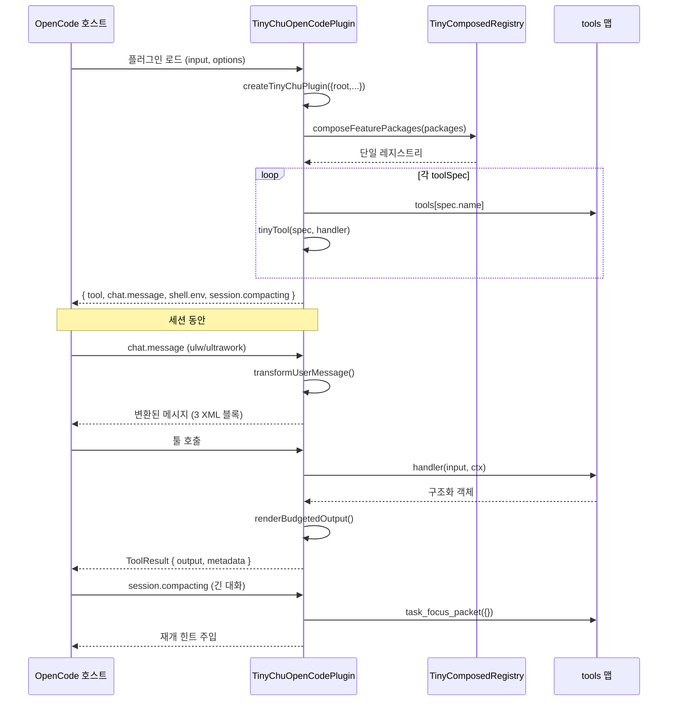

# 05. 플러그인과 훅

> [02](./02-registry-pattern.md)에서 소비 지점 2(OpenCode 브리지)를 봤습니다. 여기서는 그 브리지가 어떻게 툴을 감싸고, **네 개의 훅**으로 호스트 환경에 개입하는지 세세하게 다룹니다. 출력 예산 메커니즘도 여기서 깊이 파헤칩니다.

## 두 개의 플러그인 진입점

Tiny-Chu는 같은 레지스트리를 소비하면서 형태가 다른 두 진입점을 제공합니다:

| 진입점 | 파일 | 형태 | 누가 쓰나 |
|--------|------|------|----------|
| `createTinyChuPlugin()` | `tiny-plugin.ts:61` | `TinyPluginModule` (일반 객체) | 라이브러리 직접 사용 |
| `TinyChuOpenCodePlugin` | `plugin.ts:55` | OpenCode `Plugin` (async 함수 → `Hooks`) | OpenCode 호스트 |

`TinyChuOpenCodePlugin`은 내부적으로 `createTinyChuPlugin()`을 호출합니다 (`plugin.ts:58`). 즉, **OpenCode 플러그인은 라이브러리를 감싸는 얇은 어댑터**입니다.

## OpenCode 브리지: TinyChuOpenCodePlugin

```ts
export const TinyChuOpenCodePlugin: Plugin = async (input, options): Promise<Hooks> => {
  const parsedOptions = pluginOptions(options);              // root/safeTooling/nativePreviews
  const root = parsedOptions.root ?? input.worktree ?? input.directory;
  const tiny = createTinyChuPlugin({ root, ... });           // 단일 레지스트리 생성
  const toolMap: Record<string, ToolDefinition> = {};
  for (const spec of tiny.registry.toolSpecs) {              // ← 소비 지점 2
    const handler = tiny.tools[spec.name];
    if (handler) toolMap[spec.name] = tinyTool(spec, handler);
  }
  return { tool: toolMap, "chat.message": ..., "shell.env": ..., "experimental.session.compacting": ... };
};
```

루트 결정 우선순위: `options.root` > `input.worktree` > `input.directory`. 이 root가 모든 `.tiny/` 경로와 fail-closed 경계의 기준이 됩니다 ([06](./06-state-layer.md)).

### tinyTool() — 핸들러를 ToolDefinition으로 감싸기

`plugin.ts:31`의 `tinyTool()`는 각 핸들러를 OpenCode 툴 정의로 변환합니다. 세 가지 변환을 수행합니다:

#### 변환 1: 입력 스키마 완화
```ts
args: {
  input: tool.schema.record(tool.schema.string(), tool.schema.unknown())
    .default({})
    .describe("Tiny-Chu tool input object."),
}
```
Tiny-Chu는 강타입 입력 스키마 대신 **자유 형식 객체**를 받습니다. 각 툴 디스크립터의 `inputSchema`는 safe-tooling 툴에만 상세 정의되어 있고, 나머지는 런타임에 `stringInput()`/`numberInput()`으로 검증합니다. 이 선택의 이유는 핸들러 구현을 단순하게 유지하면서 기본 85개 툴을 일관되게 노출하기 위해서입니다.

#### 변환 2: 컨텍스트 매핑
```ts
const value = await handler(args.input, toolContext(context));
// toolContext: { sessionId: context.sessionID, targetPath: context.directory }
```
OpenCode의 `ToolContext`를 Tiny-Chu의 `TinyToolContext`로 매핑합니다.

#### 변환 3: 출력 예산 적용
```ts
const budgetInput = spec.name === "tiny_chu_install_check" && args.input.maxOutputChars === undefined
  ? { ...args.input, maxOutputChars: 20_000, maxArrayItems: 200 }   // 특례
  : args.input;
const budgeted = renderBudgetedOutput(value, budgetInput);
```

## 출력 예산 메커니즘 (`output-budget.ts`)

OpenCode 툴 출력은 LLM 컨텍스트로 들어갑니다. 소형 foreman 모델을 보호하기 위해 **일관된 잘라내기**를 적용합니다.

### `renderBudgetedOutput(value, input)` 동작

두 단계 잘라내기:

```text
1. 배열 항목 제한 (maxArrayItems, 기본 40)
   compactValue() 재귀 순회:
   · 배열 → 처음 N개만, 나머지는 { __tinyChuOmittedItems: count } 마커로 대체
   · 객체 → 키를 정렬(결정성) 후 재귀
   · 원시값 → 그대로

2. 문자 길이 제한 (maxOutputChars, 기본 8000)
   truncateOutput():
   · 초과 시 끝에 마커 추가:
     "... truncated by Tiny-Chu output budget; omittedItems=N; fullSizeChars=M"
   · 마커가 예산보다 길면 마커만으로 잘라냄
```

### 메타데이터
```ts
interface OutputBudgetMetadata {
  readonly truncated: boolean;
  readonly budget: {
    readonly maxOutputChars: number;
    readonly maxArrayItems: number;
    readonly omittedItems: number;
    readonly fullSizeChars: number;     // 잘리기 전 전체 크기
    readonly outputSizeChars: number;   // 실제 출력 크기
  };
}
```
이 메타데이터는 `ToolResult.metadata`에 들어가, 호스트가 "출력이 잘렸는지, 얼마나"를 알 수 있게 합니다.

### 특례: `tiny_chu_install_check`
이 툴은 진단 목적이므로 더 큰 기본 예산(20000자 / 200항목)을 갖습니다 (`plugin.ts:39`). install-check 결과는 한 번에 전체 패키지/툴 목록을 봐야 하기 때문입니다.

### 이원화의 핵심
- **직접 API (소비 1)**: `renderBudgetedOutput()`을 **거치지 않음**. 완전한 구조화 객체 반환. 프로그래밍적 사용에 적합.
- **OpenCode 브리지 (소비 2)**: 모든 툴 출력이 예산을 통과. LLM 컨텍스트 보호.

이 설계 덕분에 동일한 핸들러가 두 용도(프로그래밍 / LLM)에 모두 쓰입니다.

## 네 개의 훅

`TinyChuOpenCodePlugin`이 반환하는 `Hooks` 객체는 네 개의 훅을 가집니다:

### 훅 1: `tool` — 툴 맵
위에서 설명한 `toolMap`. 레지스트리의 `toolSpecs`에서 파생된 OpenCode `ToolDefinition` 모음.

### 훅 2: `chat.message` — 사용자 메시지 변환
```ts
"chat.message": async (_input, messageOutput) => {
  const textPart = messageOutput.parts.find((part) => part.type === "text");
  if (!textPart || typeof textPart.text !== "string") return;
  textPart.text = await tiny.hooks.transformUserMessage(textPart.text, { targetPath: root });
}
```

이 훅은 `tiny.hooks.transformUserMessage()` (`tiny-plugin.ts:191`)를 호출합니다. 이 함수는 **`ulw`/`ultrawork` 프롬프트에만** 반응합니다:

```ts
async transformUserMessage(message, context) {
  if (!/\b(ulw|ultrawork)\b/i.test(message)) return message;   // 다른 프롬프트는 통과
  const packet = await buildContextPacket({ ... });
  const compactGuide = renderCompactSmallContextGuide(orchestrationProfile);
  return `${message}
<tiny-chu-context>${JSON.stringify(packet, null, 2)}</tiny-chu-context>
<tiny-chu-powershell-tooling>${renderCompactPowerShellToolingGuide()}</tiny-chu-powershell-tooling>
<tiny-chu-small-context>${compactGuide.text}</tiny-chu-small-context>`;
}
```

세 개의 XML 블록을 메시지 끝에 덧붙입니다:

| 블록 | 내용 | 목적 |
|------|------|------|
| `<tiny-chu-context>` | `buildContextPacket()` 결과 JSON | bounded 컨텍스트/증거 refs |
| `<tiny-chu-powershell-tooling>` | `renderCompactPowerShellToolingGuide()` | PowerShell 따옴표/셸 안전 규칙 |
| `<tiny-chu-small-context>` | `renderCompactSmallContextGuide()` | 소형 모델 운영 간결 브리핑 |

> **왜 `ulw`/`ultrawork`에만?** 이 키워드는 "작업 루프 시작"을 의미합니다. 일반 질문에는 컨텍스트 주입이 노이즈가 되므로, 작업 모드 진입 시에만 주입합니다.

### 훅 3: `shell.env` — 환경 변수 주입
```ts
"shell.env": async (_input, envOutput) => {
  envOutput.env.TINY_CHU_ROOT = root;
  envOutput.env.TINY_CHU_OPENCODE_PLUGIN = "1";
}
```
두 환경 변수를 설정합니다:
- `TINY_CHU_ROOT` — 플러그인의 루트 경로 (상태 경로 기준)
- `TINY_CHU_OPENCODE_PLUGIN=1` — "OpenCode 호스트에서 실행 중" 표시

이 변수들은 툴 핸들러나 생성된 셸 명령이 자신의 환경을 인식하는 데 쓰입니다.

### 훅 4: `experimental.session.compacting` — 압축 시 재개 힌트
```ts
"experimental.session.compacting": async (_input, compaction) => {
  const focus = await tiny.tools.task_focus_packet({});
  compaction.context.push(
    `Tiny-Chu plugin active. Resume with task_focus_packet. ${JSON.stringify(focus)}`
  );
}
```

OpenCode 세션이 컨텍스트를 압축할 때(긴 대화), 이 훅이 `task_focus_packet` 결과를 재개 컨텍스트에 주입합니다. 압축 후에도 foreman이 "어디까지 했나"를 잃지 않도록 합니다.

`task_focus_packet`은 활성 작업 + 다음 열린 계획 체크박스 + 최신 체크포인트를 하나의 bounded 객체로 반환합니다 ([04](./04-tool-catalog.md) 참조).

## 라이브러리 훅: transformUserMessage / onSessionIdle

`TinyPluginModule.hooks` (`tiny-plugin.ts:190`)는 두 개의 직접 훅을 노출합니다:

### `transformUserMessage(message, context?)`
위 `chat.message` 훅이 호출하는 함수. `ulw`/`ultrawork` 감지와 세 블록 주입을 담당.

### `onSessionIdle({ planRef? })`
```ts
async onSessionIdle(input) {
  if (!input.planRef) return { shouldContinue: false, reason: "no active plan" };
  const status = await readPlanStatus(root, input.planRef);
  if (status.complete) return { shouldContinue: false, reason: "plan complete" };
  return { shouldContinue: true, reason: `${status.open} open checkbox item(s) remain` };
}
```

이 훅은 **계획 기반 연속(continuation)** 을 판단합니다. 활성 계획(`planRef`)이 있고 아직 완료되지 않은 체크박스가 있으면 `shouldContinue: true`를 반환합니다. 이것이 `.tiny/plans/*.md`의 체크박스가 "boulder" 스타일 작업 루프를 구동하는 방식입니다 ([06](./06-state-layer.md)의 계획 상태 섹션).

## PowerShell 툴링 프로파일 주입

`<tiny-chu-powershell-tooling>` 블록의 근원인 `POWERSHELL_TOOLING_PROFILE` (`powershell-tooling.ts`)는 다음 규칙을 인코딩합니다:

| 규칙 | 이유 |
|------|------|
| 실제 네이티브 실행 파일 사용 (`jq`, `yq`, `mdq`, `fd`, `ast-grep`, `rg`) | PowerShell 별칭이나 Unix 전용 `grep -R`/`find`/`xargs` 회피 |
| 필터/셀렉터/정규식을 **작은따옴표** | PowerShell이 `$`, `[]`, `{}`, `|`, 백틱을 확장하지 않도록 |
| 네이티브 툴 자체 `--` 분리자 | `-`로 시작하는 위치 패턴/경로 앞에 |
| 기계 판독 출력 선호 (`--json`, `-o json`, `-c`) | 결정론적 파싱 |
| `$PSNativeCommandArgumentPassing = 'Standard'` | PowerShell 7+ 복잡 인자 전달 |

소형 모델이 `pwsh`에서 Unix 습관을 쓸 때 흔히 저지르는 실수를 사전에 방지합니다. `renderPowerShellToolingGuide()`는 전체 가이드, `renderCompactPowerShellToolingGuide()`는 주입용 간결 버전입니다.

## 개발용 심(shim) vs 컴파일된 플러그인

`.opencode/plugins/tiny-chu.ts`:
```ts
export { TinyChuOpenCodePlugin as TinyChu } from "../../src/opencode/plugin.ts";
```

이 심은 **소스에서 직접** 재export합니다. 따라서:
- 이 리포지토리 루트에서 OpenCode 실행 → TypeScript 소스 직접 실행 (빌드 불필요)
- 다른 프로젝트 → `tiny-chu/opencode` (컴파일된 `dist/opencode/plugin.js`)에 의존

OpenCode는 `.opencode/plugins/`에서 프로젝트 로컬 플러그인을 자동 로드하므로, `opencode.json` 편집 없이 활성화됩니다.

## 라이프사이클 요약



## 다음 읽을 문서

- → [06-state-layer.md](./06-state-layer.md): 훅과 툴이 읽고 쓰는 `.tiny/` 상태 계층과 fail-closed 경로 안전.
- → [07-stability-contracts.md](./07-stability-contracts.md): 출력 예산과 함께 작동하는 결정성·충돌 회피 계약.
