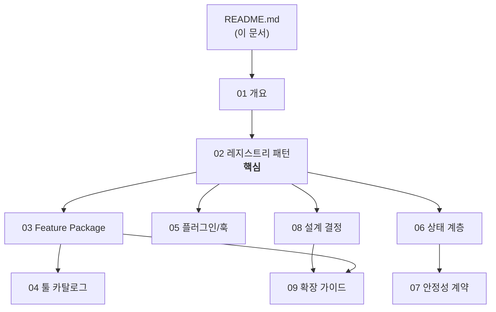

# Tiny-Chu 아키텍처 문서

> 이 디렉터리는 Tiny-Chu의 **아키텍처**를 세세하게 다루는 문서 모음입니다. 사용법/설치는 루트의 `README.md`, `HOW_TO_USE.md`, `INSTALL.md`를, 에이전트 온보딩은 `AGENTS.md`를 참고하세요.

## 이 문서 세트를 읽는 순서

Tiny-Chu를 처음 접하는 사람은 아래 순서로 읽는 것을 권장합니다. 각 문서는 자체적으로 완결성을 가지면서도 서로를 참조합니다.

| # | 문서 | 다루는 내용 | 언제 읽나 |
|---|------|-----------|----------|
| 01 | [시스템 개요](./01-overview.md) | Tiny-Chu가 무엇인지, 무엇을 의도적으로 **하지 않는지**, 런타임 가정 | 처음 |
| 02 | [레지스트리 패턴](./02-registry-pattern.md) | **하나의 레지스트리, 세 개의 소비 지점** — 전체 아키텍처의 척추 | 처음(필수) |
| 03 | [Feature Package 시스템](./03-feature-packages.md) | 패키지 디스크립터, 의존성 그래프, 위상 정렬 | 구조 이해 |
| 04 | [툴 카탈로그](./04-tool-catalog.md) | 기본 86개 툴의 패키지별 분류와 책임 | 특정 툴 작업 전 |
| 05 | [플러그인과 훅](./05-plugin-and-hooks.md) | OpenCode 브리지, 4개 훅, 출력 예산 | 호스트 연동 |
| 06 | [상태 계층](./06-state-layer.md) | `.tiny/` 레이아웃, 경로 해석, 원자적 쓰기, fail-closed | 상태 다룰 때 |
| 07 | [안정성 계약](./07-stability-contracts.md) | 루트 제약, JSON 무결성, 충돌 회피, 성능 기준치 | 경계 조건 변경 전 |
| 08 | [설계 결정](./08-design-decisions.md) | 왜 이렇게 설계했는지, 무엇을 왜 **제외**했는지 | 의도 파악 |
| 09 | [확장 가이드](./09-extending-guide.md) | 새 툴/패키지를 추가하는 올바른 절차 | 기여/확장 |

---

## 한눈에 보기

```
createTinyChuPlugin()                      ── src/opencode/tiny-plugin.ts
  │
  ├─ 평평한 tools 맵 (핸들러가 존재하는 "유일한" 장소)
  │
  └─ createDefaultTinyFeaturePackages(tools)  ── src/opencode/feature-packages/
        │   평평한 핸들러 → TinyFeaturePackage 디스크립터로 바인딩
        ▼
   composeFeaturePackages(packages)           ── src/opencode/feature-package.ts
        │   validateAndOrderFeaturePackages()
        │     · 중복 id / 중복 툴명 / 누락 의존성 / 사이클 → 거부
        │     · 위상 정렬(topological sort)
        ▼
   TinyComposedRegistry  ── 단일 진실 공급원(single source of truth)
        │
        ├─① 직접 라이브러리 API      tiny.tools[name](input, ctx)
        ├─② OpenCode 플러그인 브리지  registry.toolSpecs → tinyTool() → renderBudgetedOutput()
        └─③ install-check 진단        registry.requiredToolNames / packages / nativeToolNames
```

이 그림이 전체 아키텍처의 핵심입니다. **위에서 아래로 한 방향**으로 흐르며, 생성된 레지스트리가 세 곳에서 소비됩니다. 자세한 설명은 [02-registry-pattern.md](./02-registry-pattern.md)를 보세요.

---

## Tiny-Chu가 지키는 5가지 핵심 제약

이 제약들은 취향이 아니라 **짐을 지는(load-bearing) 불변 조건**입니다. 어기면 시스템이 깨집니다.

| # | 제약 | 의미 | 근거 |
|---|------|------|------|
| 1 | **단일 레지스트리** | 툴/패키지 정의는 `feature-packages/`의 디스크립터 한 곳에서만 나온다 | [02](./02-registry-pattern.md) |
| 2 | **모든 상태는 `.tiny/` 아래** | 경로는 반드시 `resolveTinyChuPaths(root)`로 해석 | [06](./06-state-layer.md) |
| 3 | **루트 바깥 경로는 fail-closed** | 명시적 경로(wiki ref, repoPath, markdown path)가 root를 벗어나면 거부 | [07](./07-stability-contracts.md) |
| 4 | **잘못된 JSON은 즉시 throw** | `.tiny/tasks/*.json`, `.tiny/public-jobs/*.json`이 깨지면 조용히 건너뛰지 않음 | [06](./06-state-layer.md) |
| 5 | **기본 오프라인, provider preflight만 선택적** | 프로파일·템플릿·매핑 키는 메타데이터이며, `provider_endpoint_preflight`만 명시 허용된 metadata probe 가능 | [08](./08-design-decisions.md) |

---

## 런타임 환경 한 줄 요약

- **Node ≥ 20.18**, ESM 전용, TypeScript strict + NodeNext
- **셸: PowerShell 7.6** (`pwsh -NoLogo -NoProfile`) — Unix 도구를 *가정하지 않음*
- 런타임 의존성: `@opencode-ai/plugin` 단 하나
- 배포: npm 라이브러리(`.` / `./opencode` exports) + 프로젝트 로컬 OpenCode 플러그인(`.opencode/plugins/tiny-chu.ts`)

자세한 내용은 [01-overview.md](./01-overview.md)로.

---

## 문서 관계도



---

> **작성 기준**: 이 문서는 `package.json` v0.1.0, 12개 기본 패키지 + 2개 옵션(safe-tooling) 패키지 기준입니다. 코드 식별자(함수명, 타입명, 파일 경로)는 모두 실제 소스와 1:1로 대응하며, `src/opencode/feature-package.ts`, `src/opencode/tiny-plugin.ts` 등의 실제 파일을 인용합니다.
